<!--
File: README.md
Document Title: Theme Bulletin
Author: Alysha Pursley
Date: August 2026
-->

<div align="center">


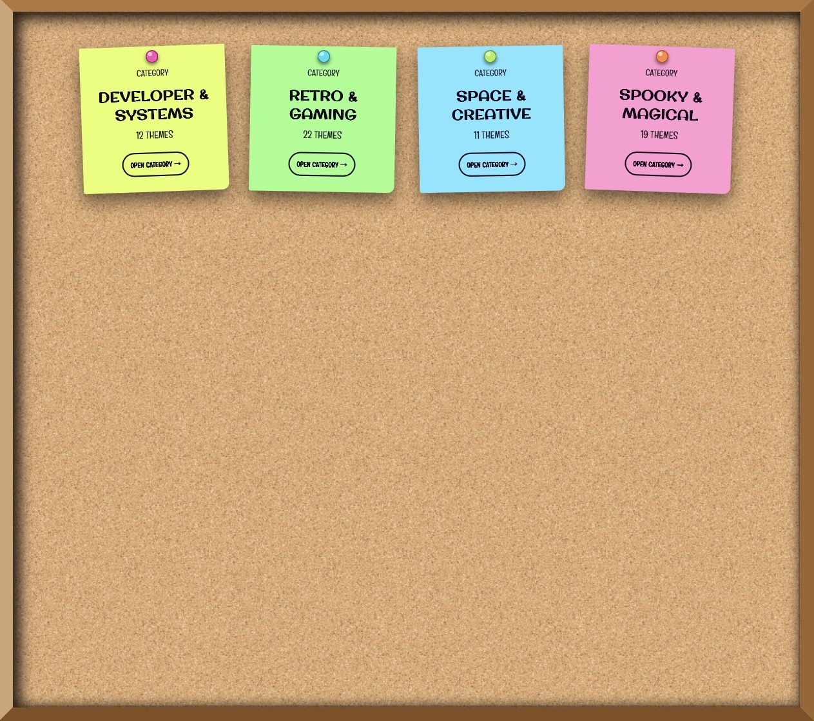


<h1>Theme Bulletin 📌</h1>

<p><a href="https://github.com/apursley2012/theme-bulletin/stargazers"></a> <a href="https://github.com/apursley2012/theme-bulletin/forks"></a> <a href="https://github.com/apursley2012/theme-bulletin/issues"></a> <a href="https://github.com/apursley2012/theme-bulletin/commits"></a> <a href="https://github.com/apursley2012/theme-bulletin"></a> <a href="https://github.com/apursley2012/theme-bulletin"></a></p>

<p><a href="https://apursley2012.github.io/theme-bulletin/"></a>    </p>

<p><strong>A sticky-note bulletin board for browsing a large collection of standalone GitHub Pages portfolio themes by category, preview, status, live site, repository, and theme detail page.</strong></p>

<p><a href="https://apursley2012.github.io/theme-bulletin/">Open the live project</a> · <a href="https://github.com/apursley2012/theme-bulletin">View the repository</a> · <a href="https://github.com/apursley2012/theme-bulletin/issues/new/choose">Report an issue or request an addition</a></p>

</div>

---

<details open>
<summary><h2><strong>Table of Contents 📖</strong></h2></summary>

*   [Project Overview 🔎](#project-overview)
    *   [Purpose 🎯](#purpose)
    *   [Design Style and Inspiration 🎨](#design-style-and-inspiration)
    *   [Main Color Palette 🌈](#main-color-palette)
    *   [Preview Screenshots 🖼️](#preview-screenshots)
*   [Key Features ✨](#key-features)
*   [Tech Stack 🛠️](#tech-stack)
*   [Live Demo 🚀](#live-demo)
*   [Installation 📦](#installation)
    *   [Local Use 💻](#local-use)
    *   [GitHub Pages Deployment 🌐](#github-pages-deployment)
*   [Usage 🧭](#usage)
*   [Project Structure 🗂️](#project-structure)
    *   [Pages Included 📄](#pages-included)
    *   [Core Files and Architecture 🧩](#core-files-and-architecture)
    *   [File and Folder Structure 🌳](#file-and-folder-structure)
*   [Themes 🧷](#themes)
    *   [Categories 🗂️](#theme-categories)
        *   [Developer & Systems](#developer-systems)
            *   [Developer Dossier](#theme-developer-dossier)
            *   [Developer.exe](#theme-developer-exe)
            *   [Dev Mode](#theme-dev-mode)
            *   [Dev Nexus](#theme-dev-nexus)
            *   [DevOS](#theme-dev-os)
            *   [Dev.Void](#theme-dev-void)
            *   [Sys Core](#theme-sys-core)
            *   [Telemetry](#theme-telemetry)
            *   [Log Portfolio](#theme-log-portfolio)
            *   [Digital Domain](#theme-digital-domain)
            *   [Artisan Developer](#theme-artisan-developer)
            *   [A Master Artificer](#theme-a-master-artificer)
        *   [Retro & Gaming](#retro-gaming)
            *   [Webmaster](#theme-webmaster)
            *   [Web Surfer](#theme-web-surfer)
            *   [Web Weaver](#theme-web-weaver)
            *   [Retro Webpage](#theme-retro-webpage)
            *   [Dark Retro Webpage](#theme-dark-retro-webpage)
            *   [Neon Retro Web](#theme-neon-retro-web)
            *   [Neocities Dev](#theme-neocities-dev)
            *   [Y2K Web](#theme-y2k-web)
            *   [Y2K Webring](#theme-y2k-webring)
            *   [Guest-Portfolio.Dev](#theme-guest-portfolio.dev)
            *   [Choose Your Destiny](#theme-choose-your-destiny)
            *   [Windows XP](#theme-windows-xp)
            *   [Windows XP Developer](#theme-windows-xp-developer)
            *   [Windows 98](#theme-windows-98)
            *   [Old Windows](#theme-old-windows)
            *   [RetroWin](#theme-retrowin)
            *   [Neon Retro Sys Admin](#theme-neon-retro-sys-admin)
            *   [Dev Mode Arcade](#theme-dev-mode-arcade)
            *   [Player One](#theme-player-one)
            *   [Press Start](#theme-press-start)
            *   [V-Doom](#theme-v-doom)
            *   [Dev Arcade](#theme-dev-arcade)
        *   [Space & Creative](#space-creative)
            *   [Observatory](#theme-observatory)
            *   [Space Mission](#theme-space-mission)
            *   [Cosmic Developer](#theme-cosmic-developer)
            *   [Aurora Cosmos](#theme-aurora-cosmos)
            *   [Aurora Drift](#theme-aurora-drift)
            *   [Aurora Borealis](#theme-aurora-borealis)
            *   [Retro Cosmic Arcade](#theme-retro-cosmic-arcade)
            *   [Colorful](#theme-colorful)
            *   [Color Melt](#theme-color-melt)
            *   [Groovy](#theme-groovy)
            *   [Dyed in the Wool](#theme-dyed-in-the-wool)
        *   [Spooky & Magical](#spooky-magical)
            *   [Oracle](#theme-oracle)
            *   [Full-Stack Sorcerer](#theme-full-stack-sorcerer)
            *   [Digital Alchemy](#theme-digital-alchemy)
            *   [Digital Coven](#theme-digital-coven)
            *   [Systems Witch](#theme-systems-witch)
            *   [Sys-Witch](#theme-sys-witch)
            *   [Witch Dev](#theme-witch-dev)
            *   [The Craft](#theme-the-craft)
            *   [Spell Index](#theme-spell-index)
            *   [Sorcerer](#theme-sorcerer)
            *   [Full Moon](#theme-full-moon)
            *   [Fortune Seeker](#theme-fortune-seeker)
            *   [Magical](#theme-magical)
            *   [Dev Haunt](#theme-dev-haunt)
            *   [Spooky](#theme-spooky)
            *   [Spooky Developer](#theme-spooky-developer)
            *   [Mystery Haunting](#theme-mystery-haunting)
            *   [Welcome Mortals](#theme-welcome-mortals)
            *   [Nightshade](#theme-nightshade)
*   [Collection Relationship 🗞️](#collection-relationship)
*   [Customization Guide 🎨](#customization-guide)
*   [Accessibility and Browser Compatibility ♿](#accessibility-and-browser-compatibility)
*   [Repository Relationship 🔗](#repository-relationship)
*   [Project Scope and Limitations 📌](#project-scope-and-limitations)
*   [Possible Future Enhancements 💡](#possible-future-enhancements)
*   [Contributing 🤝](#contributing)
    *   [Reporting Issues 🐛](#reporting-issues)
    *   [Requesting Additions 📝](#requesting-additions)
*   [License 📜](#license)
*   [Important Links 🔗](#important-links)
*   [Attrubution ℹ️️](#attribution)

</details>

---

<a id="project-overview"></a>

<details open>
<summary><h2><strong>Project Overview 🔎</strong></h2></summary>


**Theme Bulletin** is a searchable catalog for a collection of standalone website themes. Instead of reducing dozens of distinct designs to repository links, it gives each theme a visible identity through categories, short descriptions, home-page previews, live demos, repository links, and individual documentation.

I created the project to make a large design collection practical to explore. Visitors can compare visual directions, narrow the catalog by category, open a theme directly, and move from a preview to the full standalone repository without needing to know the theme name in advance. The bulletin acts as the directory, while each theme remains an independent site that can be customized and published on its own.

The README follows that same catalog model. It documents how Theme Bulletin is organized, explains the relationship between the collection and individual repositories, and includes a categorized theme directory whose short descriptions are kept identical to the descriptions at the top of the individual theme READMEs.

</details>

<a id="purpose"></a>

<details open>
<summary><h3><strong>Purpose 🎯</strong></h3></summary>


I created **Theme Bulletin** because a growing collection of standalone website themes becomes difficult to browse once it is reduced to a long list of repository links. The project gives the collection a central catalog where each theme can be searched, filtered by category, previewed, checked for availability, and opened as a live site or repository. Its purpose is to make the themes easy to discover and compare while allowing every design to remain an independent, reusable project with its own code and documentation.
</details>

<a id="design-style-and-inspiration"></a>

<details open>
<summary><h3><strong>Design Style and Inspiration 🎨</strong></h3></summary>


Theme Bulletin is built around a literal bulletin-board idea rather than a conventional theme gallery. Cork tones create the shared surface, while yellow, blue, pink, green, and cream paper colors distinguish theme notes and supporting information. Dark ink, green controls, and orange accents keep the collection navigable even when many notes are visible at once. The physical-board metaphor gives the collection its personality, but search, filtering, status, previews, and links remain the functional center.

</details>

<a id="main-color-palette"></a>

<details open>
<summary><h3><strong>Main Color Palette 🌈</strong></h3></summary>


I pulled the palette below directly from the current project stylesheet `assets/css/01-sticky-note-bulletin-board.css`.

Each row lists every interface-use category identified for that exact color value in the documented stylesheet analysis. When one hex value is reused for several jobs, I keep all of those uses together in the same row instead of reducing it to a single generic label.

| Hex | Color Name | Complete Use in the Interface |
| --- | --- | --- |
| `#CAA06F` | Cork | Main bulletin-board surface |
| `#8D6138` | Dark Cork | Cork depth; edges; and darker board details |
| `#3F2B19` | Cork Shadow | Deep shadows and board contrast |
| `#FFF6A9` | Sticky Yellow | Yellow theme notes and paper surfaces |
| `#C9F3FF` | Sticky Blue | Blue theme notes and paper surfaces |
| `#FFD1E3` | Sticky Pink | Pink theme notes and paper surfaces |
| `#CFF7D2` | Sticky Green | Green theme notes and paper surfaces |
| `#FFFDF4` | Paper White | Cream-white notes; cards; and light surfaces |
| `#20252C` | Ink | Primary text and strong interface details |
| `#4A525C` | Soft Ink | Secondary text and supporting copy |
| `#2D6A4F` | Board Green | Navigation; actions; and functional accents |
| `#D86C2F` | Board Orange | Secondary accent and highlighted controls |

</details>

<a id="preview-screenshots"></a>

<details open>
<summary><h3><strong>Preview Screenshots 🖼️</strong></h3></summary>


<div align="center">

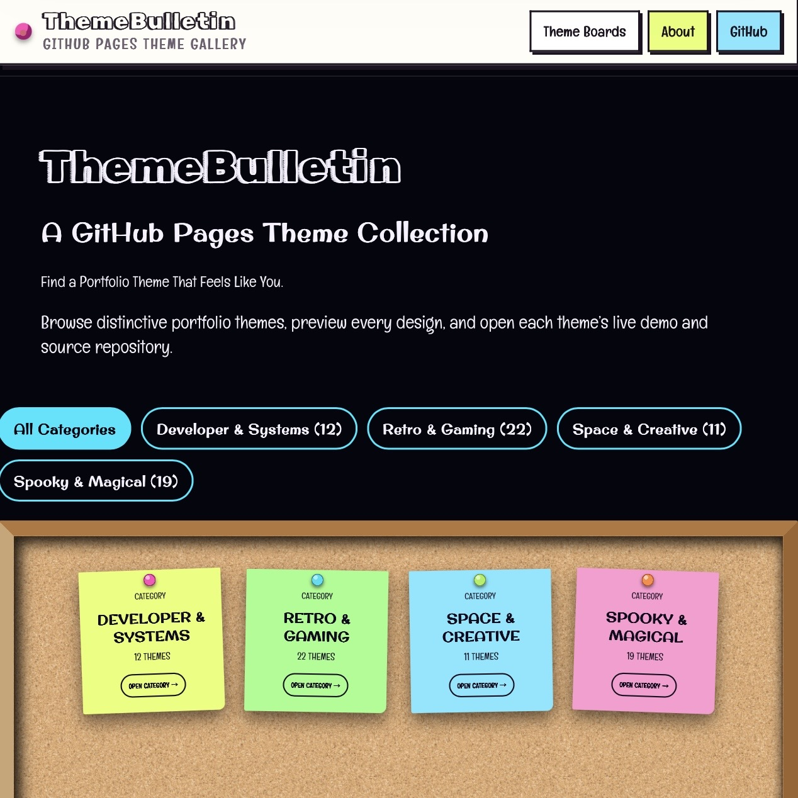

</div>


Click any preview image in the repository screenshot folder to open the full-size file.

<details open>
<summary><h4><strong>Screenshot Gallery 🖼️</strong></h4></summary>

The gallery uses paired, centered images when screenshots are present. Keep screenshots under `images/screenshots/` and use names such as `theme-bulletin-screenshot-01.png`, `theme-bulletin-screenshot-02.png`, and so on. I have not invented image filenames that were not verified in the current project source.

</details>

</details>

---

<a id="key-features"></a>

<details open>
<summary><h2><strong>Key Features ✨</strong></h2></summary>


*   **Browse the linked portfolio-theme collection from one page**
*   **Search themes by name and descriptive content**
*   **Filter by theme category**
*   **Open theme-specific detail pages and previews**
*   **Jump to each available live demo and source repository**
*   **Display unavailable/manual-review status without hiding the entry**
*   **Keep the gallery data in a dedicated theme data file**
*   **Use a responsive bulletin-board interface rather than a generic card dashboard**

</details>

---

<a id="tech-stack"></a>

<details open>
<summary><h2><strong>Tech Stack 🛠️</strong></h2></summary>


*   **HTML**
*   **CSS**
*   **JavaScript**
*   **Data-driven theme metadata**
*   **GitHub Pages**
*   **Static image assets**

</details>

---

<a id="live-demo"></a>

<details open>
<summary><h2><strong>Live Demo 🚀</strong></h2></summary>


Open the published project here:

[https://apursley2012.github.io/theme-bulletin/](https://apursley2012.github.io/theme-bulletin/)

</details>

---

<a id="installation"></a>

<details open>
<summary><h2><strong>Installation 📦</strong></h2></summary>


</details>

<a id="local-use"></a>

<details open>
<summary><h3><strong>Local Use 💻</strong></h3></summary>


1. Clone or download the repository.
2. Keep the existing folder structure intact so the page can still find its styles, scripts, data, and assets.
3. Open the root `index.html` for static projects, or follow the project-specific runtime instructions when a backend/source application is included.
4. Before I publish changes, I check the main workflow, navigation, saved browser data where it applies, and the responsive layout.

</details>

<a id="github-pages-deployment"></a>

<details open>
<summary><h3><strong>GitHub Pages Deployment 🌐</strong></h3></summary>


For the static/public portion, keep `index.html` at the repository root, use relative asset paths, then enable **Settings → Pages → Deploy from a branch → main → / (root)**. Projects that include Python, Node, MongoDB, authentication, browser automation, or another server runtime still need an appropriate backend host for those server-dependent features.

</details>

---

<a id="usage"></a>

<details open>
<summary><h2><strong>Usage 🧭</strong></h2></summary>


Start with the main page and follow the project’s primary workflow. The interface is intended to be usable without reading the source first, while the case studies, articles, documentation, and source folders provide the deeper implementation context. Where browser storage is used, saved information belongs to that browser/device unless the project explicitly includes a shared backend.

</details>

---

<a id="project-structure"></a>

<details open>
<summary><h2><strong>Project Structure 🗂️</strong></h2></summary>


</details>

<a id="pages-included"></a>

<details open>
<summary><h3><strong>Pages Included 📄</strong></h3></summary>


| Page / Area | Purpose |
| --- | --- |
| `index.html` | Main bulletin-board gallery |
| `data/themes.js` | Theme inventory, links, categories, summaries, and availability data |
| `assets/css/01-sticky-note-bulletin-board.css` | Primary bulletin-board design |
| `assets/css/theme-detail.css` | Theme detail-page styling |
| `theme detail pages` | Individual theme information and preview views |

</details>

<a id="core-files-and-architecture"></a>

<details open>
<summary><h3><strong>Core Files and Architecture 🧩</strong></h3></summary>


The repository separates the public interface from supporting source and documentation where the project needs that distinction. The important rule is that **Theme Bulletin should be documented as the project it is**, not as a generic theme or one-size-fits-all site. Files that implement the main workflow belong with the application, while case studies, articles, source history, data, or backend code are documented according to their real role.

</details>

<a id="file-and-folder-structure"></a>

<details open>
<summary><h3><strong>File and Folder Structure 🌳</strong></h3></summary>


```text
theme-bulletin/
├── README.md
├── index.html
├── data/themes.js
├── assets/css/01-sticky-note-bulletin-board.css
├── assets/css/theme-detail.css
└── theme detail pages
```

This tree highlights the major documented areas rather than inventing files that were not verified.

</details>

---

<a id="themes"></a>

<details open>
<summary><h2><strong>Themes 🧷</strong></h2></summary>

Theme Bulletin brings together a growing collection of standalone website themes that explore very different approaches to presenting the same kinds of professional content. Some are built around developer workspaces, terminals, operating systems, and technical dashboards; others lean into retro computing, arcade interfaces, celestial environments, handcrafted creative layouts, or darker magical themes. Each theme has its own visual language, page structure, interaction patterns, component choices, and personality while still supporting the practical content a professional site needs.

I organized the collection into broad categories to make those differences easier to explore without forcing every design into an overly narrow label. A visitor can start with a category that fits the type of experience they want, compare the individual themes visually, then open the complete standalone project for the design that interests them. Each theme remains independent from Theme Bulletin, so it can be customized, maintained, and deployed without depending on the catalog itself.

<a id="theme-categories"></a>

<details open>
<summary><h2><strong>Categories 🗂️</strong></h2></summary>

<div align="center">

The categories group related visual directions without treating them as interchangeable templates. They make it easier to move from a broad design family to a specific implementation while preserving each theme’s independent identity, repository, documentation, and live site.

<a id="developer-systems"></a>

<h3><strong>Developer & Systems</strong></h3>

<a id="theme-developer-dossier"></a>

<h3><a href="https://apursley2012.github.io/developer-dossier/"><strong>Developer Dossier</strong></a></h3>

A classified-file portfolio that presents projects, experience, and technical strengths as a polished professional dossier.

[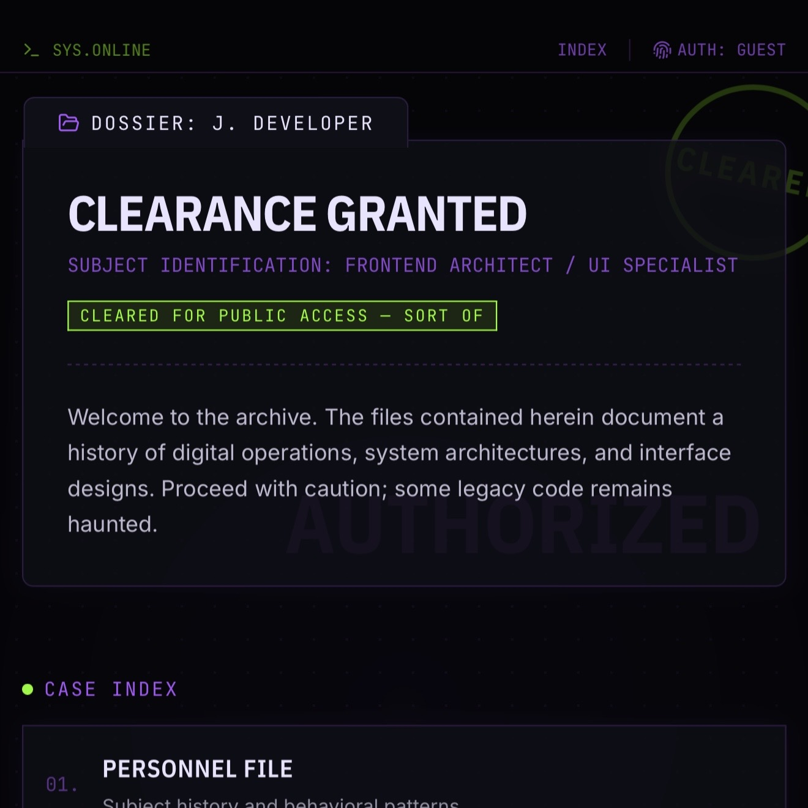](https://apursley2012.github.io/developer-dossier/)

[Live theme](https://apursley2012.github.io/developer-dossier/) · [Repository](https://github.com/apursley2012/developer-dossier)

---

<a id="theme-developer-exe"></a>

<h3><a href="https://apursley2012.github.io/developer-exe/"><strong>Developer.exe</strong></a></h3>

A neon executable-style portfolio with a focused launch-screen introduction and crisp system-inspired navigation.

[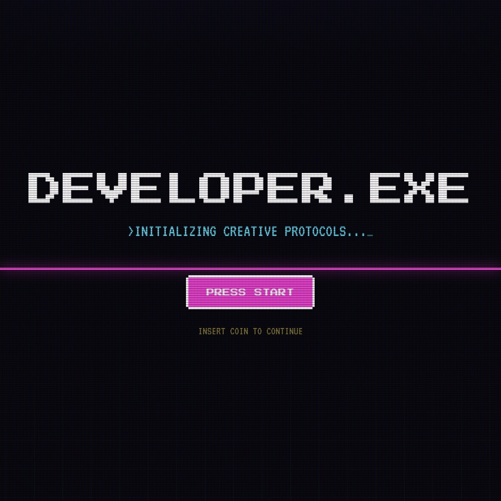](https://apursley2012.github.io/developer-exe/)

[Live theme](https://apursley2012.github.io/developer-exe/) · [Repository](https://github.com/apursley2012/developer-exe)

---

<a id="theme-dev-mode"></a>

<h3><a href="https://apursley2012.github.io/dev-mode/"><strong>Dev Mode</strong></a></h3>

A developer-console portfolio that combines debug-panel styling, modular content blocks, and a confident technical identity.

[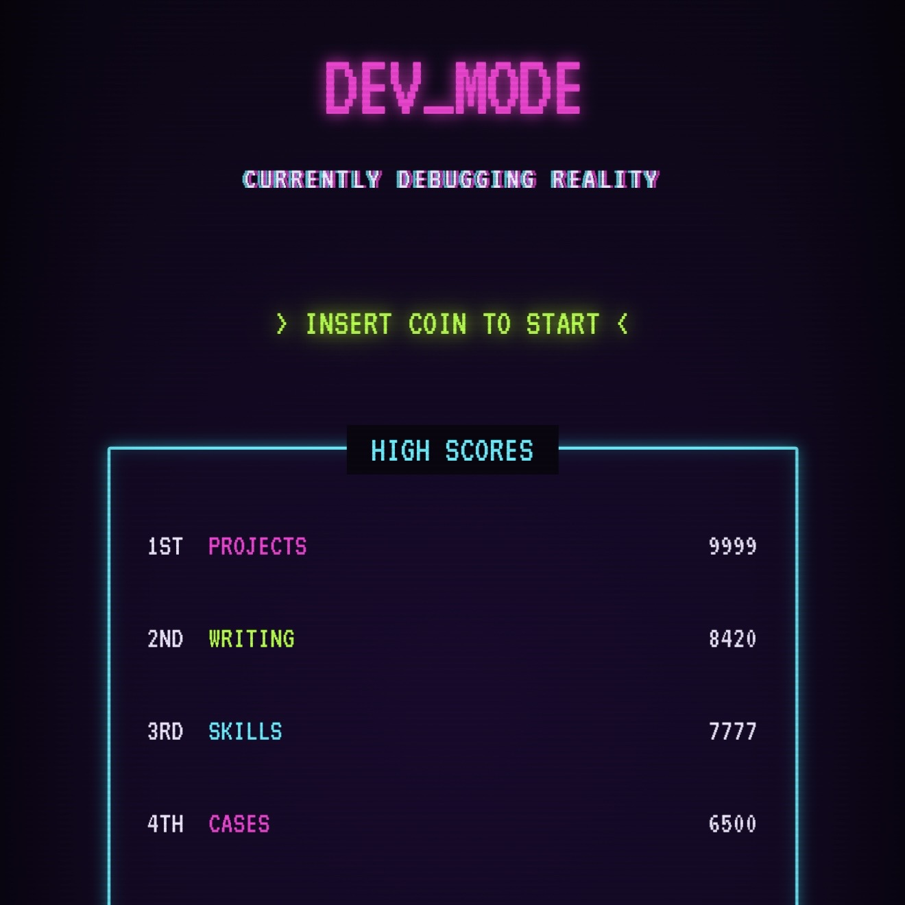](https://apursley2012.github.io/dev-mode/)

[Live theme](https://apursley2012.github.io/dev-mode/) · [Repository](https://github.com/apursley2012/dev-mode)

---

<a id="theme-dev-nexus"></a>

<h3><a href="https://apursley2012.github.io/dev-nexus/"><strong>Dev Nexus</strong></a></h3>

A connected technical hub with orbiting interface details, a centered introduction, and a sleek systems-dashboard atmosphere.

[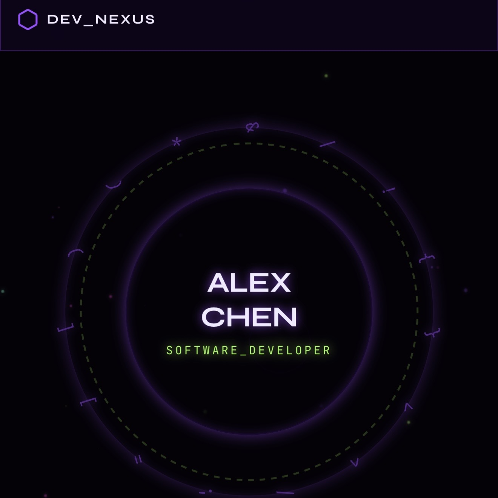](https://apursley2012.github.io/dev-nexus/)

[Live theme](https://apursley2012.github.io/dev-nexus/) · [Repository](https://github.com/apursley2012/dev-nexus)

---

<a id="theme-dev-os"></a>

<h3><a href="https://apursley2012.github.io/dev-os/"><strong>DevOS</strong></a></h3>

A minimal operating-system landing experience that frames the portfolio as a clean, direct developer workspace.

[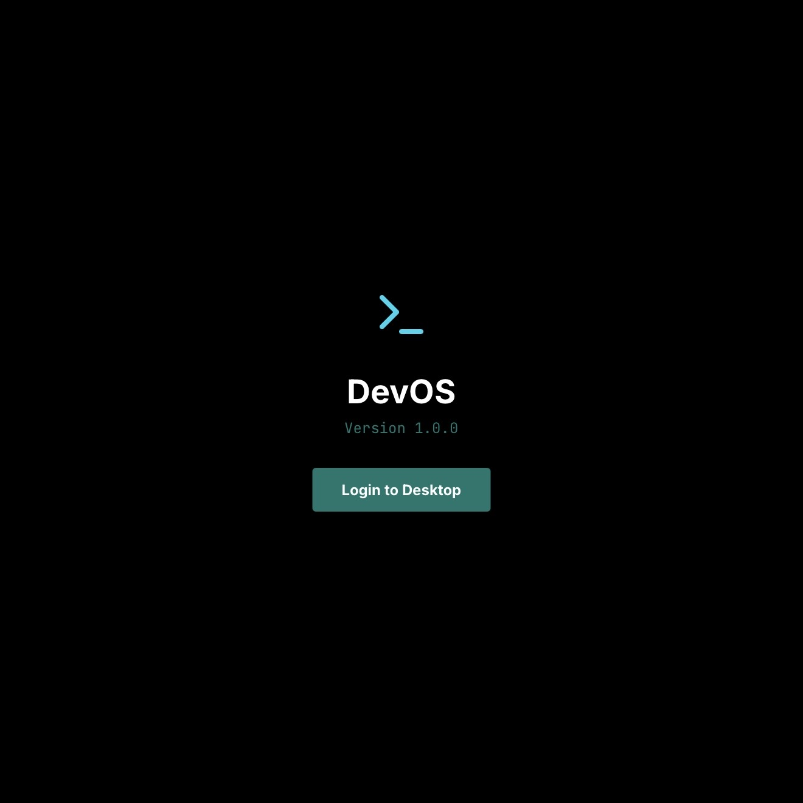](https://apursley2012.github.io/dev-os/)

[Live theme](https://apursley2012.github.io/dev-os/) · [Repository](https://github.com/apursley2012/dev-os)

---

<a id="theme-dev-void"></a>

<h3><a href="https://apursley2012.github.io/dev-void/"><strong>dev.void</strong></a></h3>

A dark, minimal portfolio built around negative space, precise typography, and a quiet futuristic developer presence.

[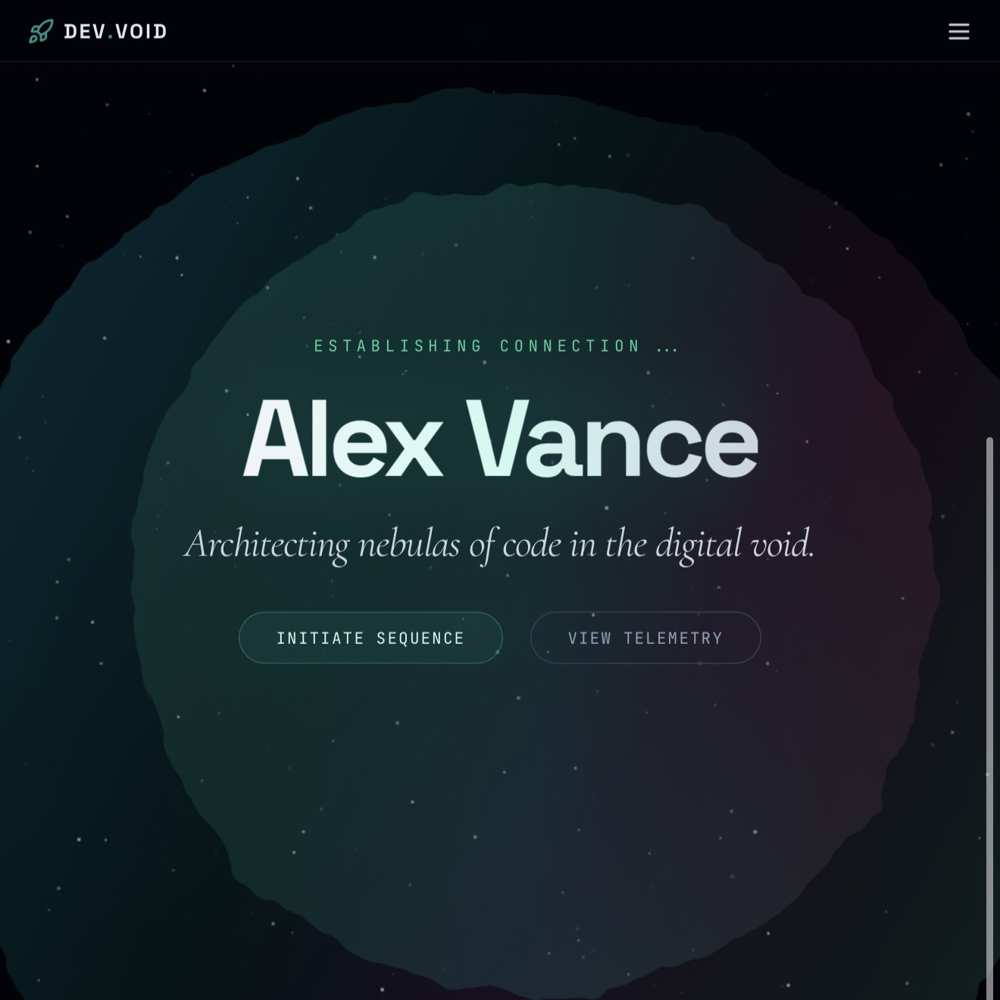](https://apursley2012.github.io/dev-void/)

[Live theme](https://apursley2012.github.io/dev-void/) · [Repository](https://github.com/apursley2012/dev-void)

---

<a id="theme-sys-core"></a>

<h3><a href="https://apursley2012.github.io/sys-core/"><strong>Sys-Core</strong></a></h3>

A system-core portfolio with orbital interface elements, dark technical styling, and a strong command-center identity.

[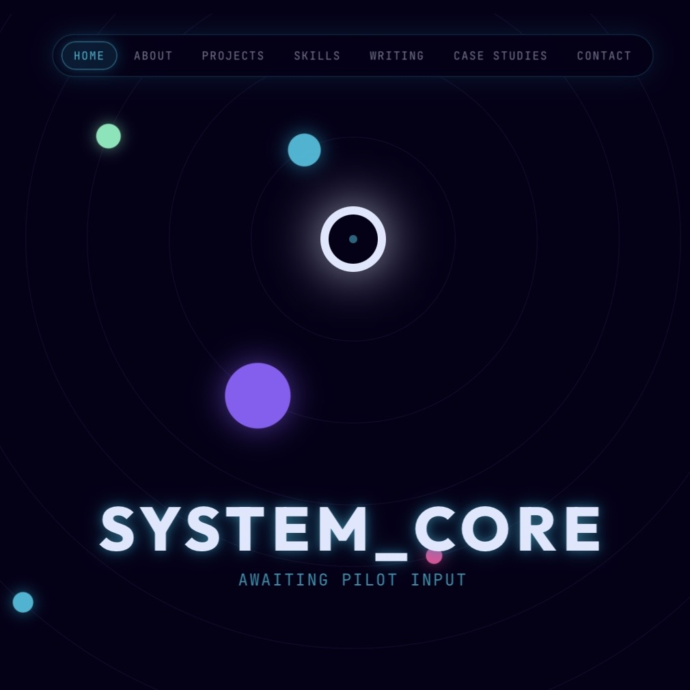](https://apursley2012.github.io/sys-core/)

[Live theme](https://apursley2012.github.io/sys-core/) · [Repository](https://github.com/apursley2012/sys-core)

---

<a id="theme-telemetry"></a>

<h3><a href="https://apursley2012.github.io/telemetry/"><strong>Telemetry</strong></a></h3>

A telemetry-inspired portfolio that uses measured spacing, signal-like details, and an atmospheric technical interface.

[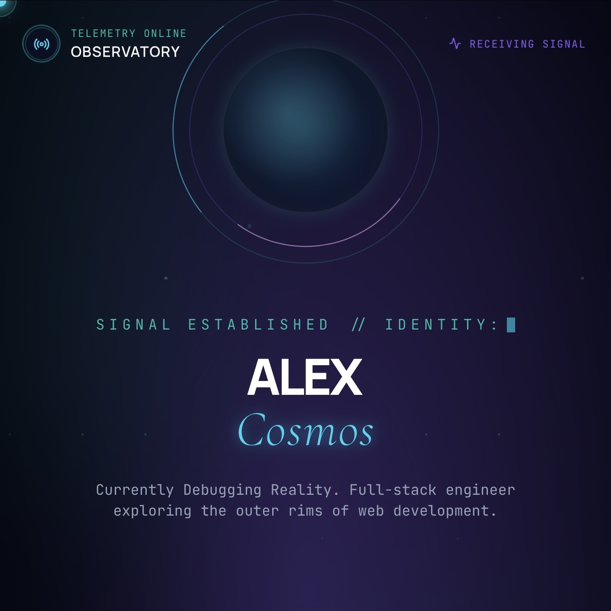](https://apursley2012.github.io/telemetry/)

[Live theme](https://apursley2012.github.io/telemetry/) · [Repository](https://github.com/apursley2012/telemetry)

---

<a id="theme-log-portfolio"></a>

<h3><a href="https://apursley2012.github.io/log-portfolio/"><strong>Log Portfolio</strong></a></h3>

A logbook-style developer portfolio that treats projects and experience as organized technical records.

[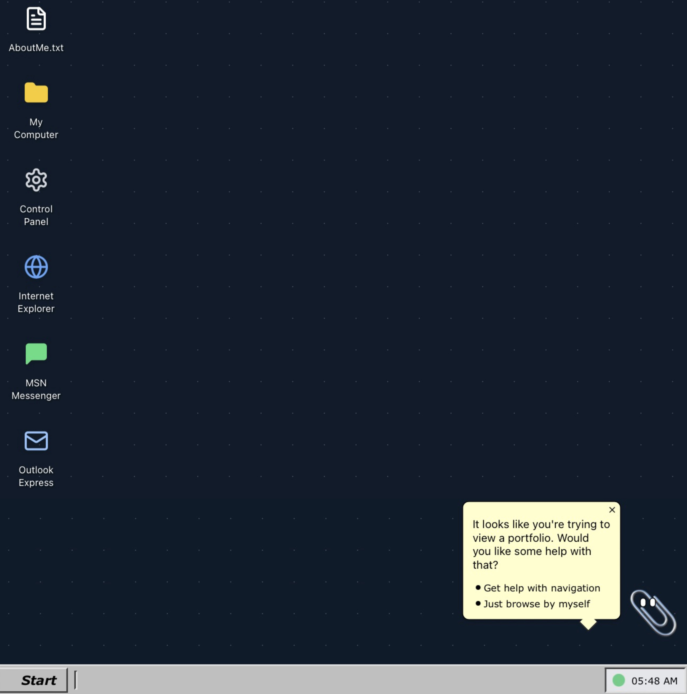](https://apursley2012.github.io/log-portfolio/)

[Live theme](https://apursley2012.github.io/log-portfolio/) · [Repository](https://github.com/apursley2012/log-portfolio)

---

<a id="theme-digital-domain"></a>

<h3><a href="https://apursley2012.github.io/digital-domain/"><strong>Digital Domain</strong></a></h3>

A retro browser-and-desktop portfolio that presents work inside a bright personal digital domain.

[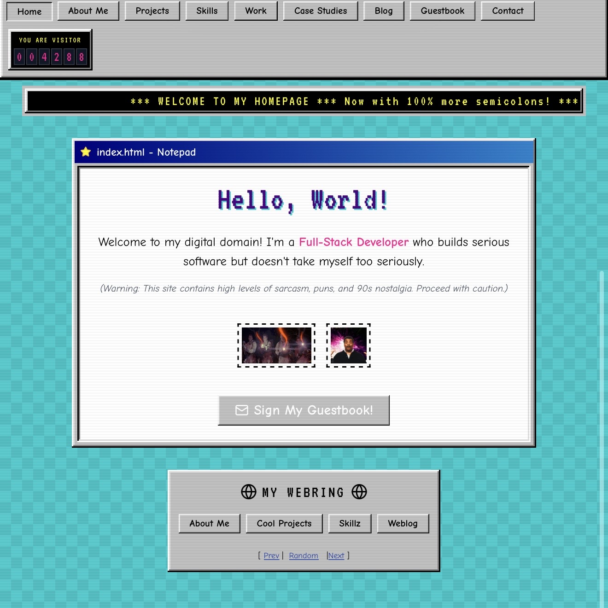](https://apursley2012.github.io/digital-domain/)

[Live theme](https://apursley2012.github.io/digital-domain/) · [Repository](https://github.com/apursley2012/digital-domain)

---

<a id="theme-artisan-developer"></a>

<h3><a href="https://apursley2012.github.io/artisan-developer/"><strong>Artisan Developer</strong></a></h3>

A handcrafted creative-development portfolio inspired by dye, fabric, color mixing, and the care of making digital work by hand.

[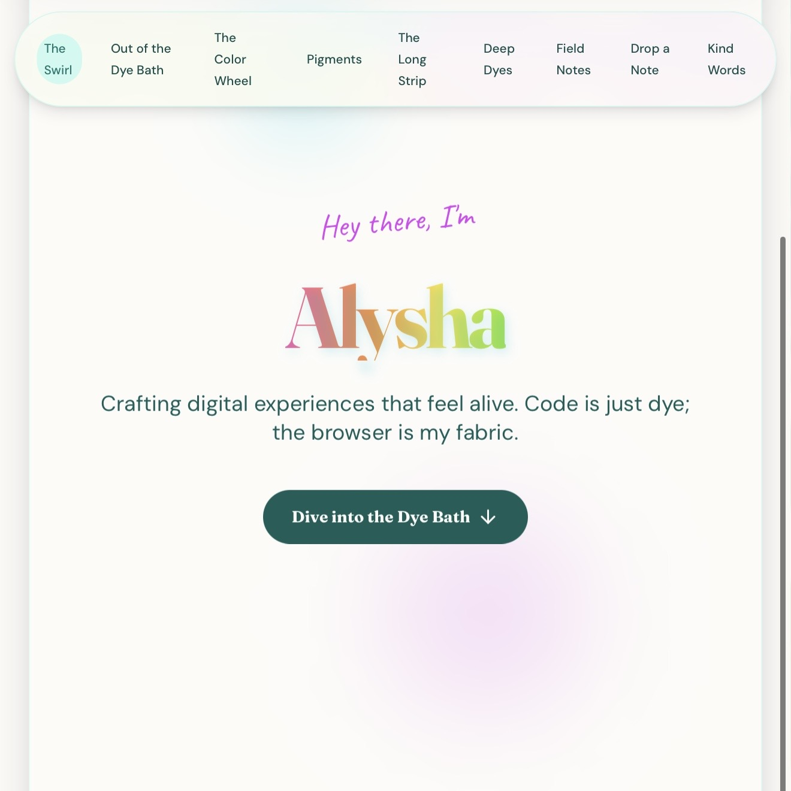](https://apursley2012.github.io/artisan-developer/)

[Live theme](https://apursley2012.github.io/artisan-developer/) · [Repository](https://github.com/apursley2012/artisan-developer)

---

<a id="theme-a-master-artificer"></a>

<h3><a href="https://apursley2012.github.io/a-master-artificer/"><strong>A Master Artificer</strong></a></h3>

A workshop-inspired portfolio with handcrafted typography, instrument-like details, and an inventor’s-desk sense of precision.

[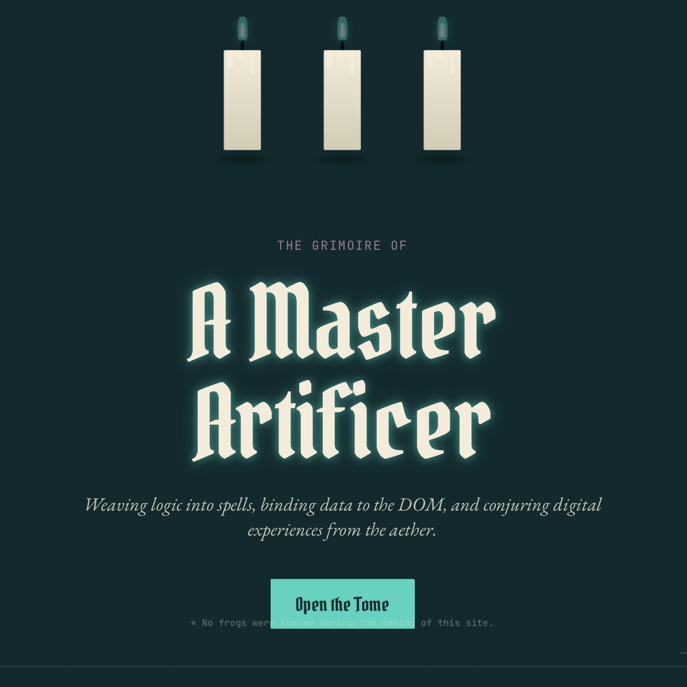](https://apursley2012.github.io/a-master-artificer/)

[Live theme](https://apursley2012.github.io/a-master-artificer/) · [Repository](https://github.com/apursley2012/a-master-artificer)

---

<a id="retro-gaming"></a>

<h3><strong>Retro & Gaming</strong></h3>

<a id="theme-webmaster"></a>

<h3><a href="https://apursley2012.github.io/webmaster/"><strong>Webmaster</strong></a></h3>

An early-web homepage with browser-era framing, playful navigation, and a deliberately nostalgic personal-site personality.

[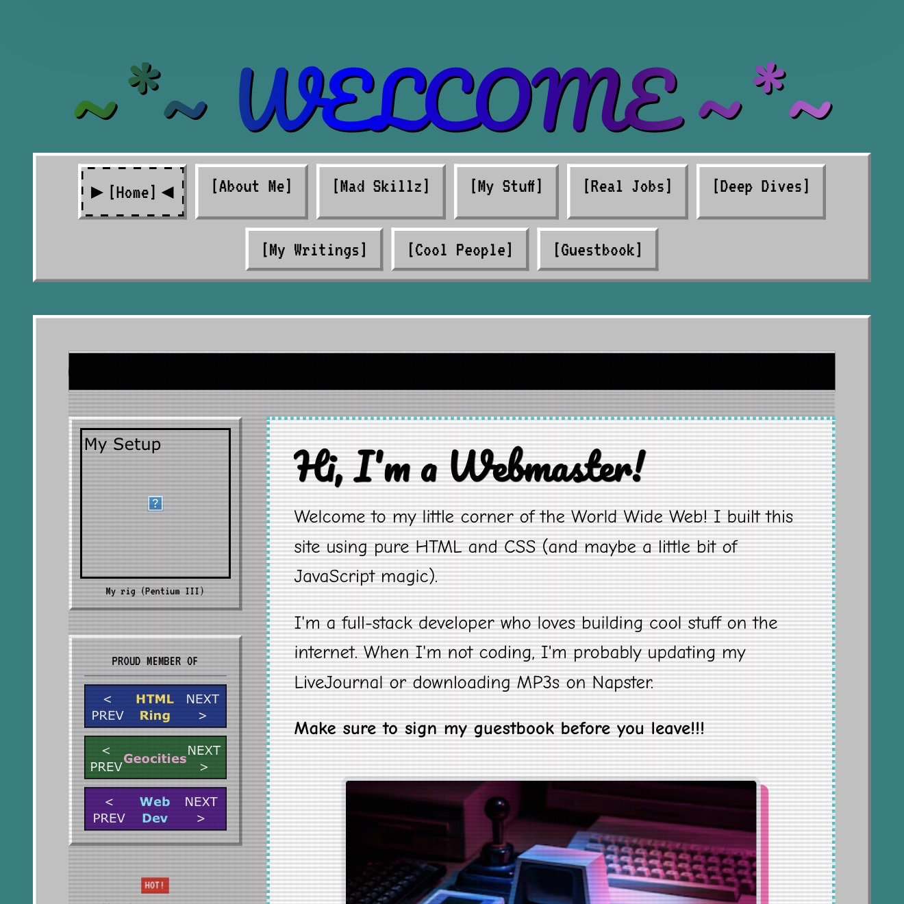](https://apursley2012.github.io/webmaster/)

[Live theme](https://apursley2012.github.io/webmaster/) · [Repository](https://github.com/apursley2012/webmaster)

---

<a id="theme-web-surfer"></a>

<h3><a href="https://apursley2012.github.io/web-surfer/"><strong>Web Surfer</strong></a></h3>

A bright retro-web portfolio presented through layered browser windows and a playful internet-surfer identity.

[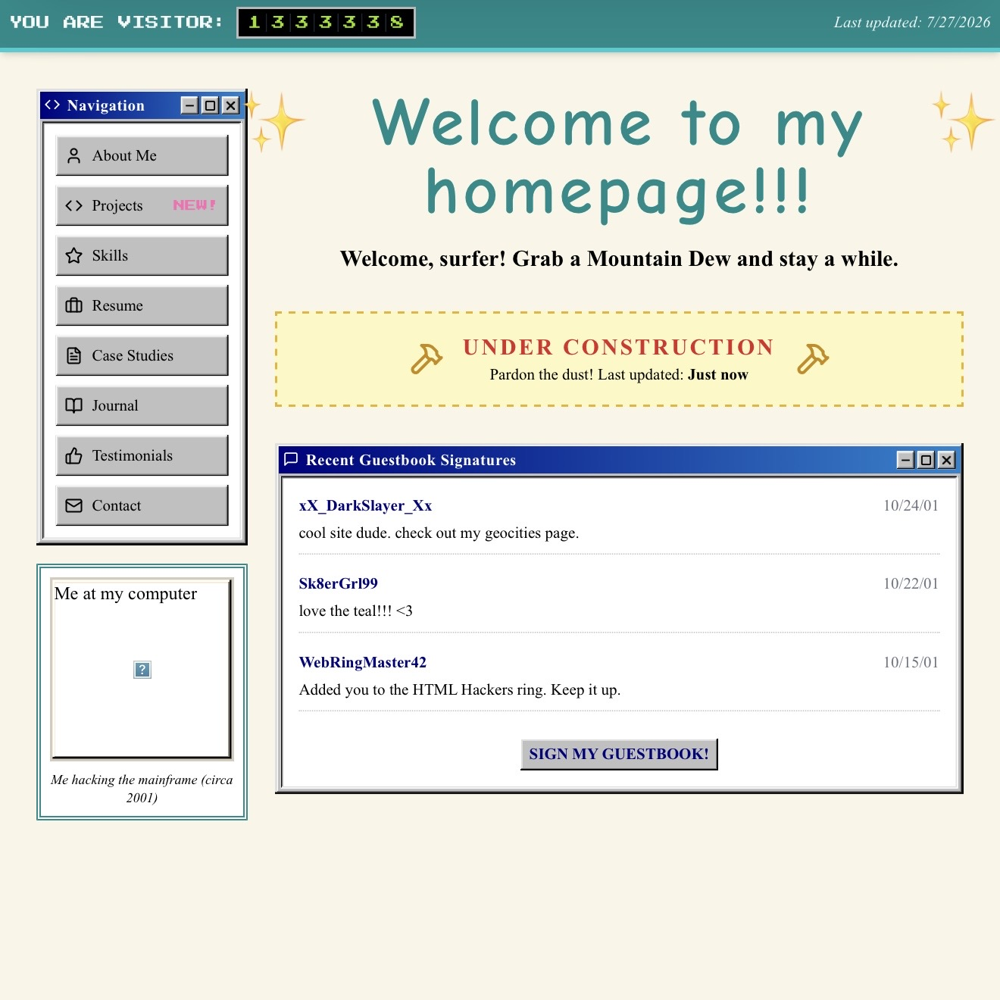](https://apursley2012.github.io/web-surfer/)

[Live theme](https://apursley2012.github.io/web-surfer/) · [Repository](https://github.com/apursley2012/web-surfer)

---

<a id="theme-web-weaver"></a>

<h3><a href="https://apursley2012.github.io/web-weaver/"><strong>Web Weaver</strong></a></h3>

A dark web-crafting portfolio with connected panels, circular motifs, and an interface that feels woven together.

[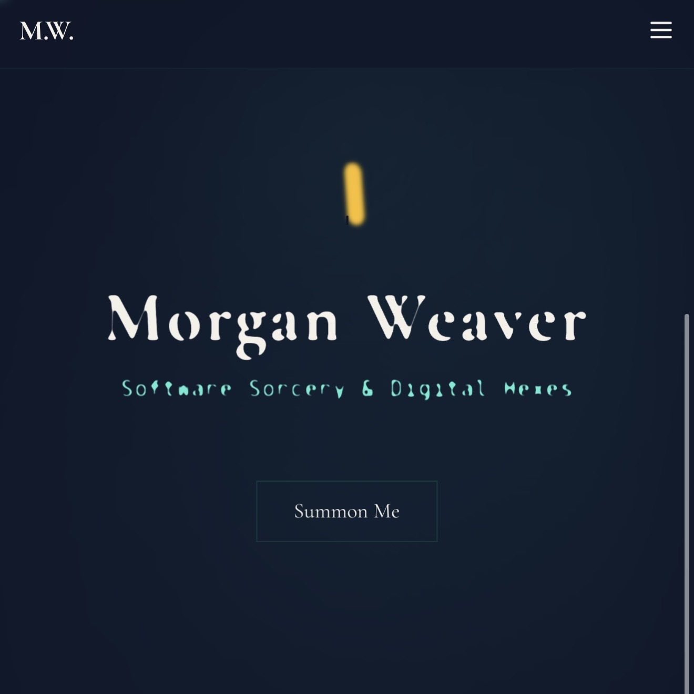](https://apursley2012.github.io/web-weaver/)

[Live theme](https://apursley2012.github.io/web-weaver/) · [Repository](https://github.com/apursley2012/web-weaver)

---

<a id="theme-retro-webpage"></a>

<h3><a href="https://apursley2012.github.io/retro-webpage/"><strong>Retro Webpage</strong></a></h3>

A classic personal-homepage theme with colorful browser chrome, old-web layout conventions, and handcrafted internet charm.

[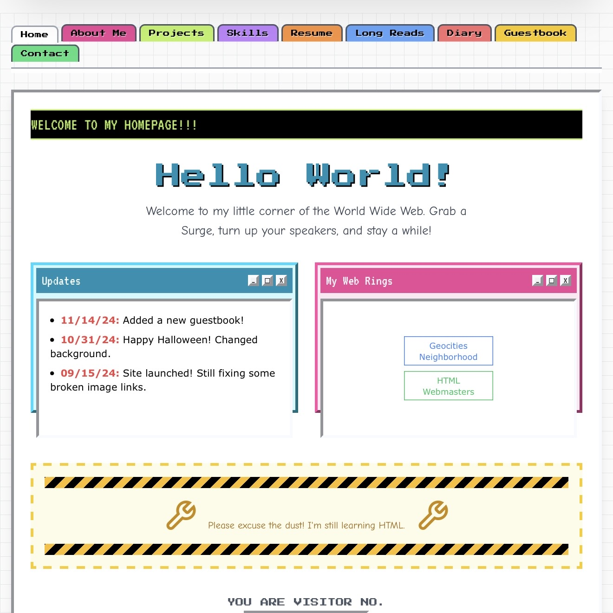](https://apursley2012.github.io/retro-webpage/)

[Live theme](https://apursley2012.github.io/retro-webpage/) · [Repository](https://github.com/apursley2012/retro-webpage)

---

<a id="theme-dark-retro-webpage"></a>

<h3><a href="https://apursley2012.github.io/dark-retro-webpage/"><strong>Dark Retro Webpage</strong></a></h3>

A shadowy late-1990s and early-2000s web portfolio with pixel typography, Winamp-inspired details, and unapologetic personality.

[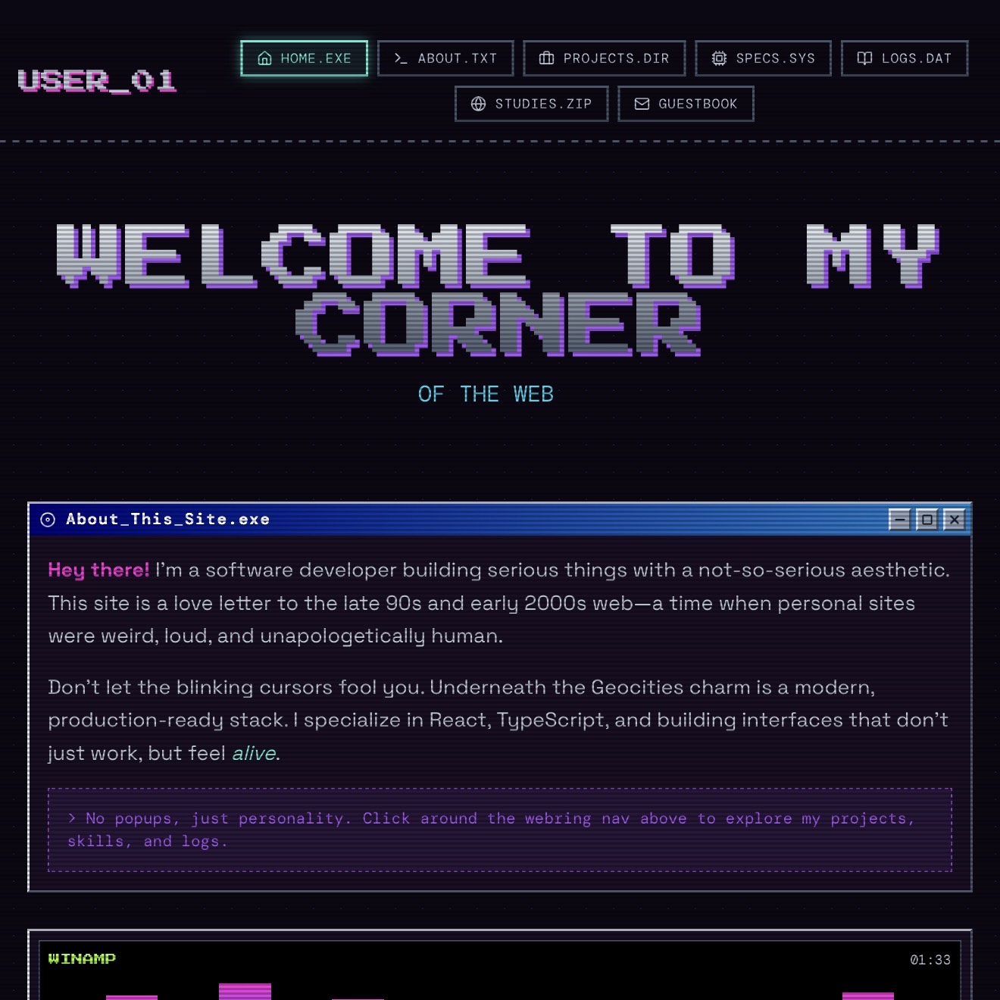](https://apursley2012.github.io/dark-retro-webpage/)

[Live theme](https://apursley2012.github.io/dark-retro-webpage/) · [Repository](https://github.com/apursley2012/dark-retro-webpage)

---

<a id="theme-neon-retro-web"></a>

<h3><a href="https://apursley2012.github.io/neon-retro-web/"><strong>Neon Retro Web</strong></a></h3>

A neon systems-dashboard portfolio that blends old-school terminal energy with bright cyber color and modular information panels.

[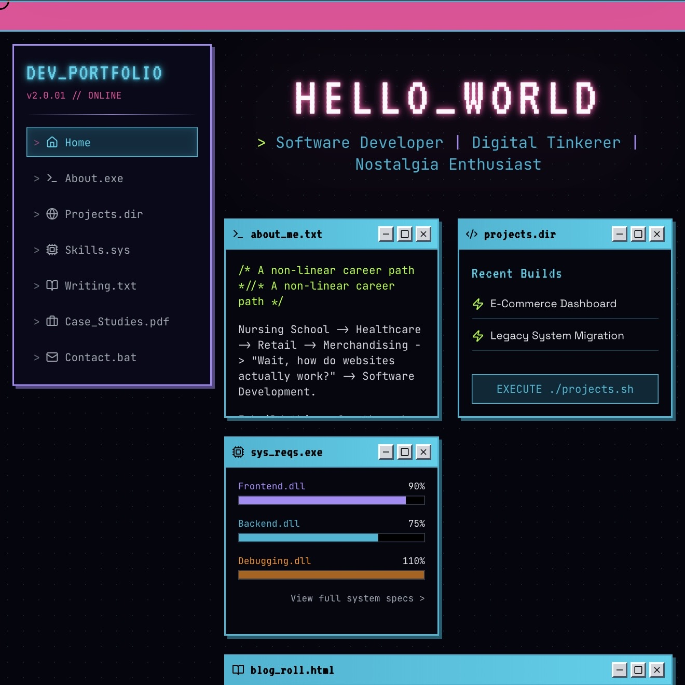](https://apursley2012.github.io/neon-retro-web/)

[Live theme](https://apursley2012.github.io/neon-retro-web/) · [Repository](https://github.com/apursley2012/neon-retro-web)

---

<a id="theme-neocities-dev"></a>

<h3><a href="https://apursley2012.github.io/neocities-dev/"><strong>Neocities Dev</strong></a></h3>

A desktop-and-browser homage to handmade personal sites, complete with windowed content and playful old-web presentation.

[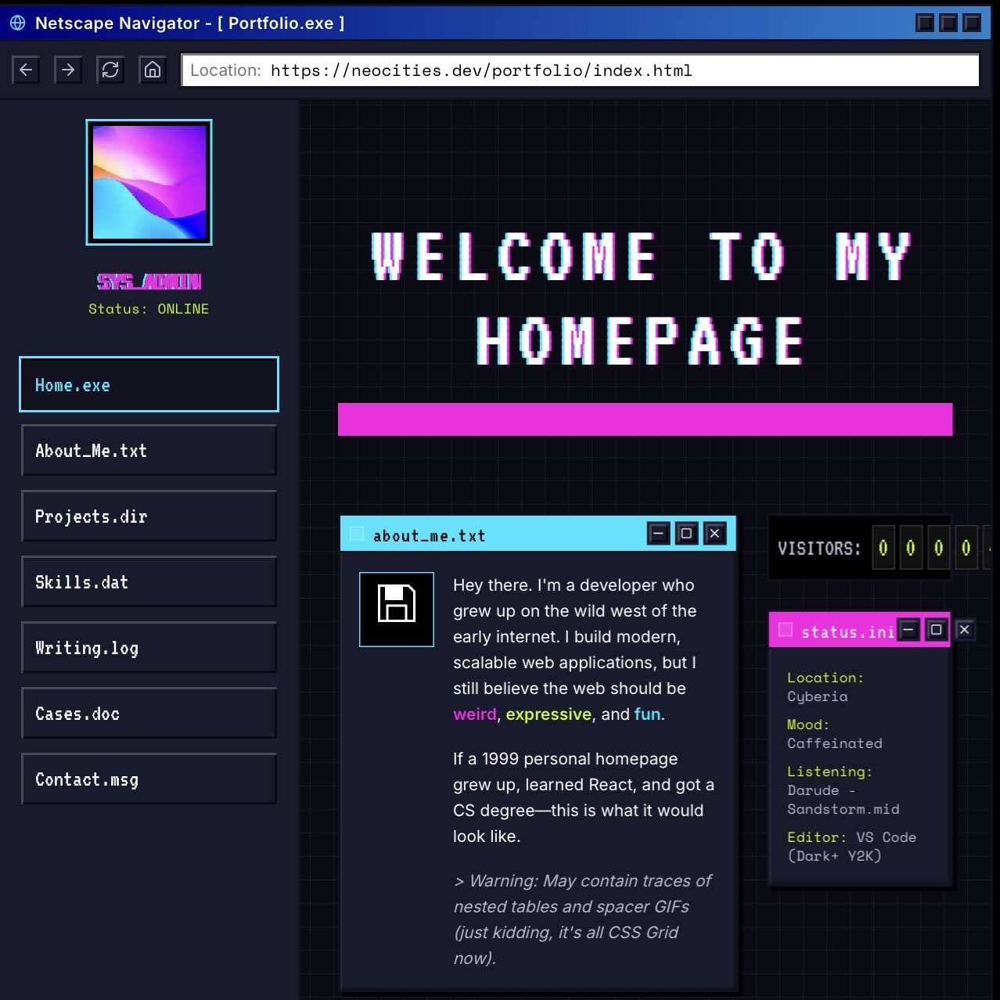](https://apursley2012.github.io/neocities-dev/)

[Live theme](https://apursley2012.github.io/neocities-dev/) · [Repository](https://github.com/apursley2012/neocities-dev)

---

<a id="theme-y2k-web"></a>

<h3><a href="https://apursley2012.github.io/y2k-web/"><strong>Y2K Web</strong></a></h3>

A glossy Y2K homepage with compact browser-era content blocks, bright interface accents, and turn-of-the-millennium energy.

[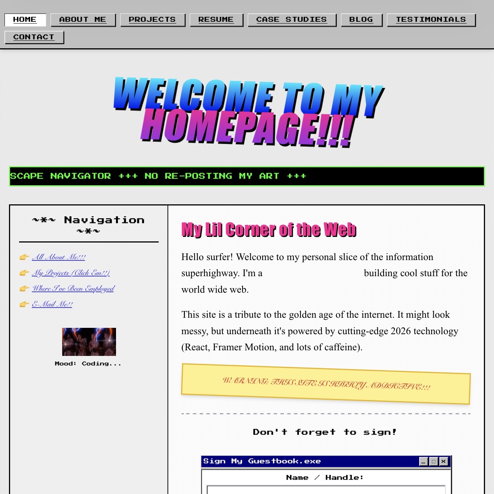](https://apursley2012.github.io/y2k-web/)

[Live theme](https://apursley2012.github.io/y2k-web/) · [Repository](https://github.com/apursley2012/y2k-web)

---

<a id="theme-y2k-webring"></a>

<h3><a href="https://apursley2012.github.io/y2k-webring/"><strong>Y2K Webring</strong></a></h3>

A personal webring portfolio with retro window panels, visitor-counter spirit, and a community-web sense of discovery.

[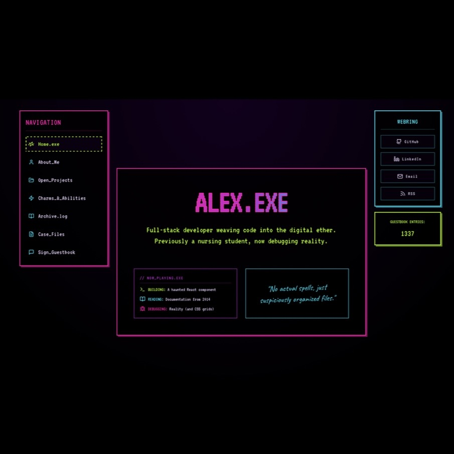](https://apursley2012.github.io/y2k-webring/)

[Live theme](https://apursley2012.github.io/y2k-webring/) · [Repository](https://github.com/apursley2012/y2k-webring)

---

<a id="theme-guest-portfolio.dev"></a>

<h3><a href="https://apursley2012.github.io/guest-portfolio.dev/"><strong>Guest-Portfolio.Dev</strong></a></h3>

A command-line guest-session portfolio that turns technical content into a compact terminal-style browsing experience.

[](https://apursley2012.github.io/guest-portfolio.dev/)

[Live theme](https://apursley2012.github.io/guest-portfolio.dev/) · [Repository](https://github.com/apursley2012/guest-portfolio.dev)

---

<a id="theme-choose-your-destiny"></a>

<h3><a href="https://apursley2012.github.io/choose-your-destiny/"><strong>Choose Your Destiny</strong></a></h3>

A choice-driven portfolio landing page that presents different professional paths as selectable game-like routes.

[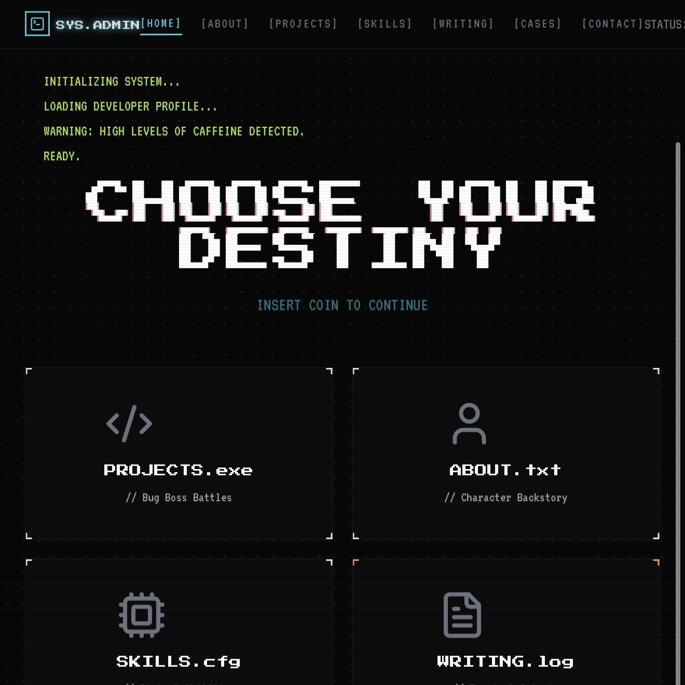](https://apursley2012.github.io/choose-your-destiny/)

[Live theme](https://apursley2012.github.io/choose-your-destiny/) · [Repository](https://github.com/apursley2012/choose-your-destiny)

---

<a id="theme-windows-xp"></a>

<h3><a href="https://apursley2012.github.io/windows-xp/"><strong>Windows XP</strong></a></h3>

A faithful Windows XP-inspired desktop portfolio with familiar taskbar, windows, icons, and operating-system interactions.

[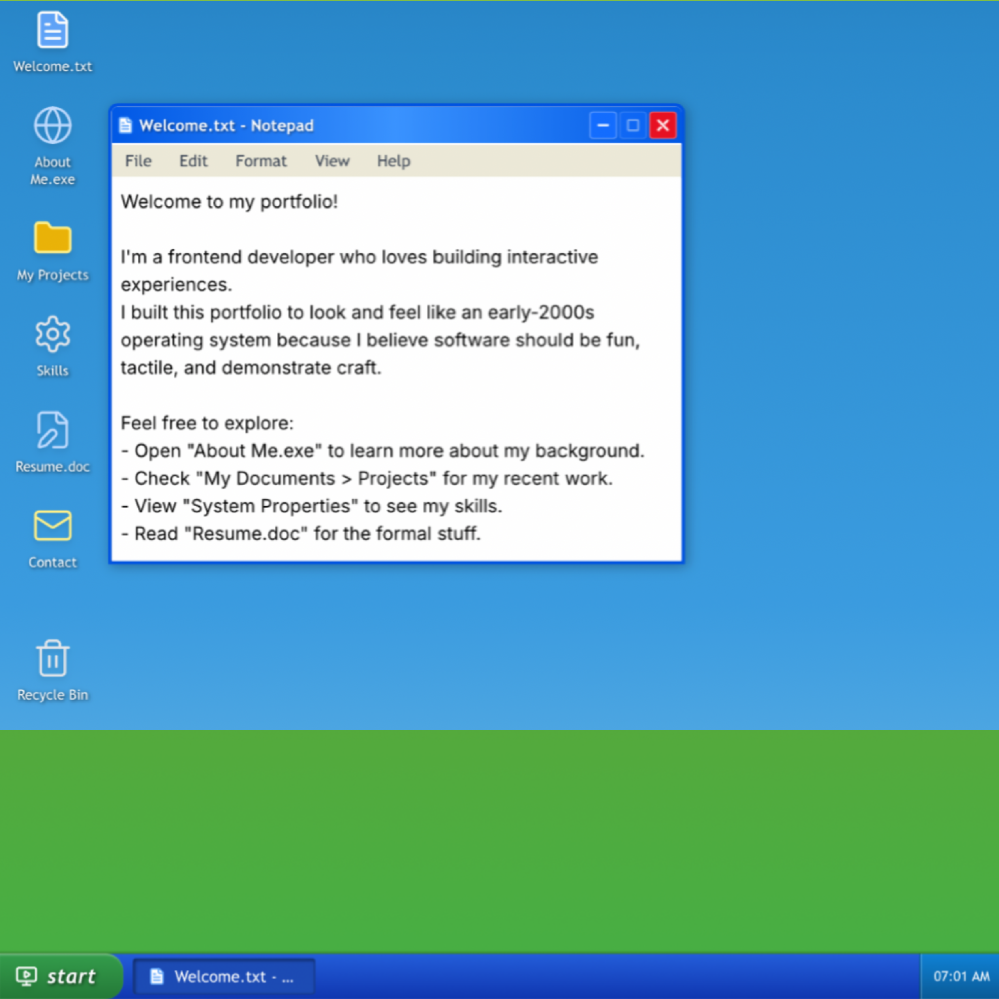](https://apursley2012.github.io/windows-xp/)

[Live theme](https://apursley2012.github.io/windows-xp/) · [Repository](https://github.com/apursley2012/windows-xp)

---

<a id="theme-windows-xp-developer"></a>

<h3><a href="https://apursley2012.github.io/windows-xp-developer/"><strong>Windows XP Developer</strong></a></h3>

A bright Aqua-and-XP-inspired developer desktop with glossy controls, floating interface elements, and playful nostalgia.

[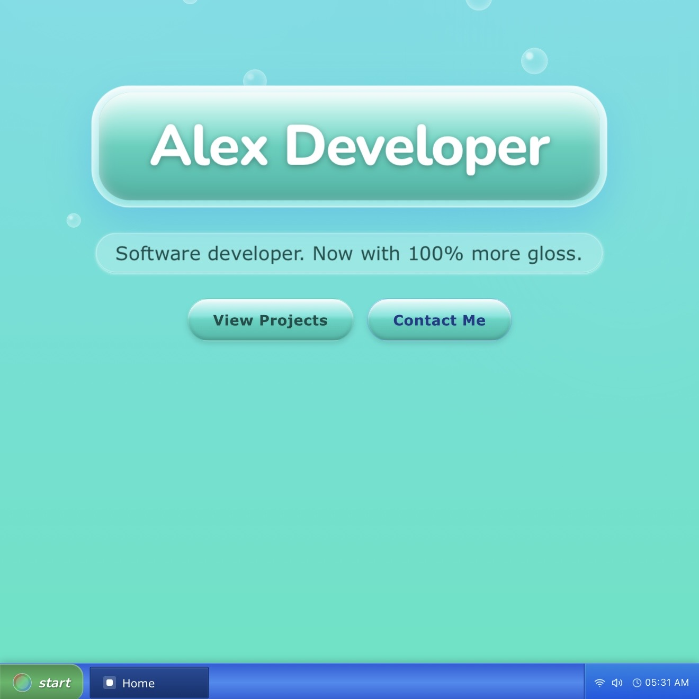](https://apursley2012.github.io/windows-xp-developer/)

[Live theme](https://apursley2012.github.io/windows-xp-developer/) · [Repository](https://github.com/apursley2012/windows-xp-developer)

---

<a id="theme-windows-98"></a>

<h3><a href="https://apursley2012.github.io/windows-98/"><strong>Windows 98</strong></a></h3>

A Windows 98-style portfolio with classic desktop icons, dialog windows, teal wallpaper, and familiar system chrome.

[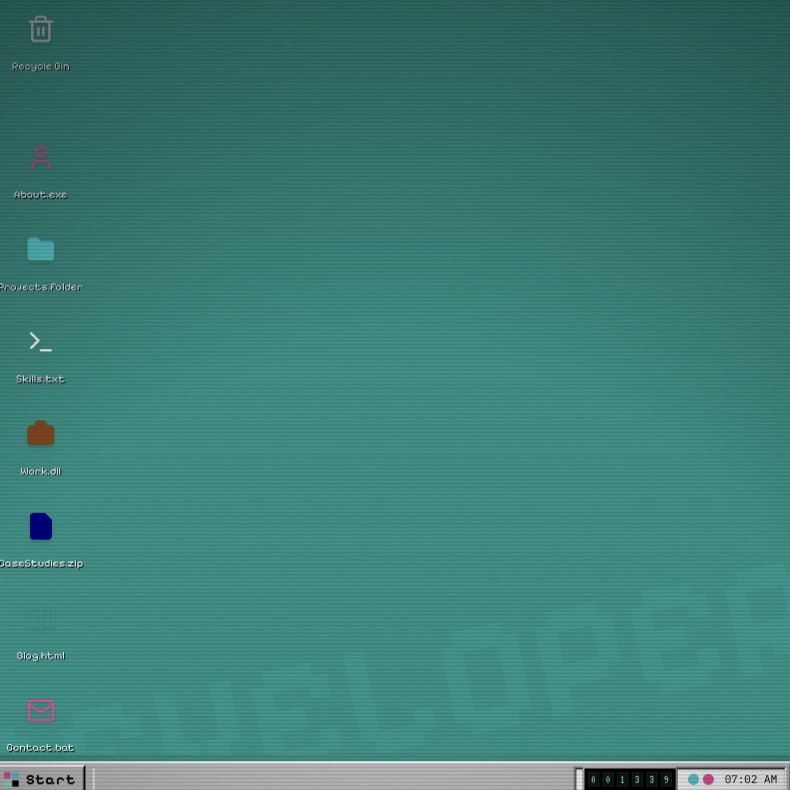](https://apursley2012.github.io/windows-98/)

[Live theme](https://apursley2012.github.io/windows-98/) · [Repository](https://github.com/apursley2012/windows-98)

---

<a id="theme-old-windows"></a>

<h3><a href="https://apursley2012.github.io/old-windows/"><strong>Old Windows</strong></a></h3>

A vintage desktop portfolio that recreates early Windows navigation, application windows, and a practical old-computer workspace.

[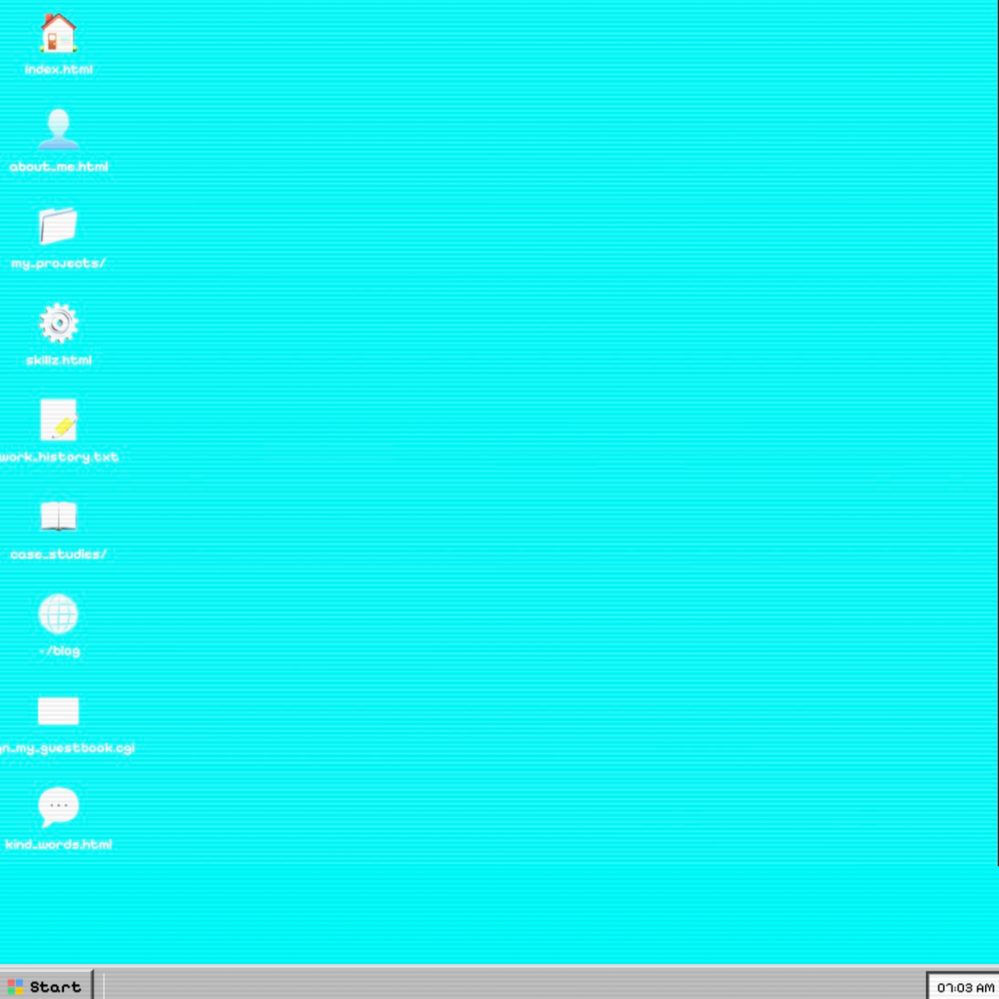](https://apursley2012.github.io/old-windows/)

[Live theme](https://apursley2012.github.io/old-windows/) · [Repository](https://github.com/apursley2012/old-windows)

---

<a id="theme-retrowin"></a>

<h3><a href="https://apursley2012.github.io/retrowin/"><strong>RetroWin</strong></a></h3>

A compact retro Windows portfolio with classic window controls, teal desktop styling, and a friendly welcome dialog.

[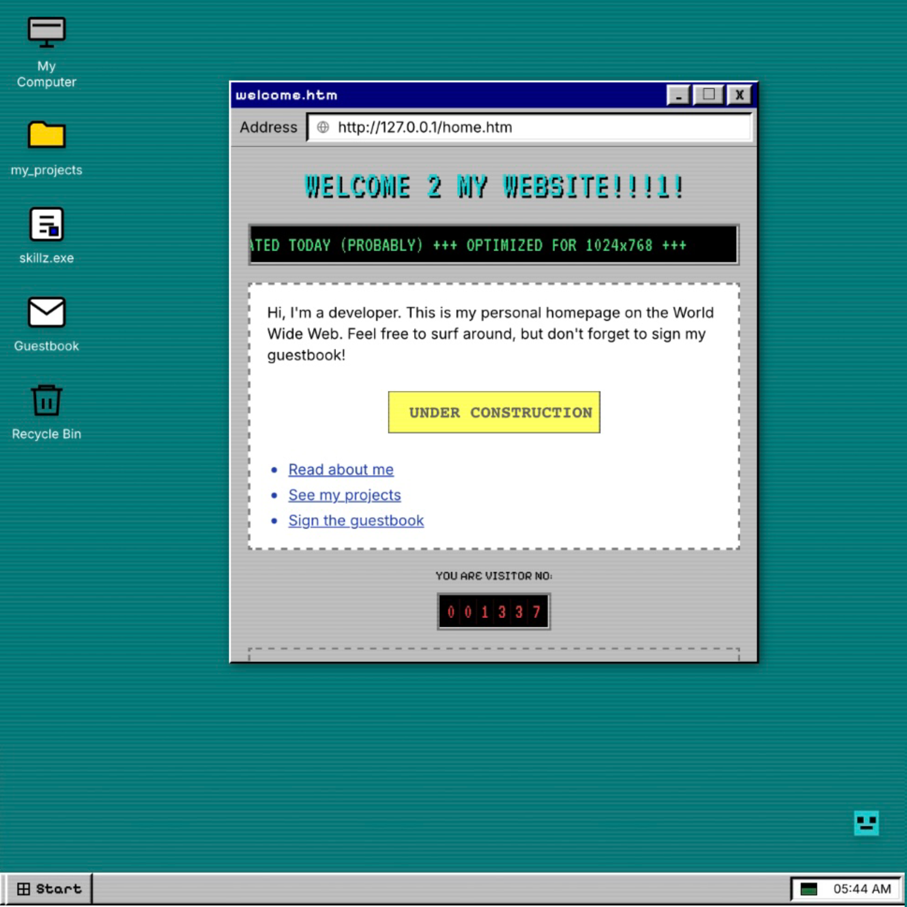](https://apursley2012.github.io/retrowin/)

[Live theme](https://apursley2012.github.io/retrowin/) · [Repository](https://github.com/apursley2012/retrowin)

---

<a id="theme-neon-retro-sys-admin"></a>

<h3><a href="https://apursley2012.github.io/neon-retro-sys-admin/"><strong>Neon Retro Sys Admin</strong></a></h3>

A high-contrast systems-administrator portfolio with neon status panels, technical readouts, and arcade-like interface energy.

[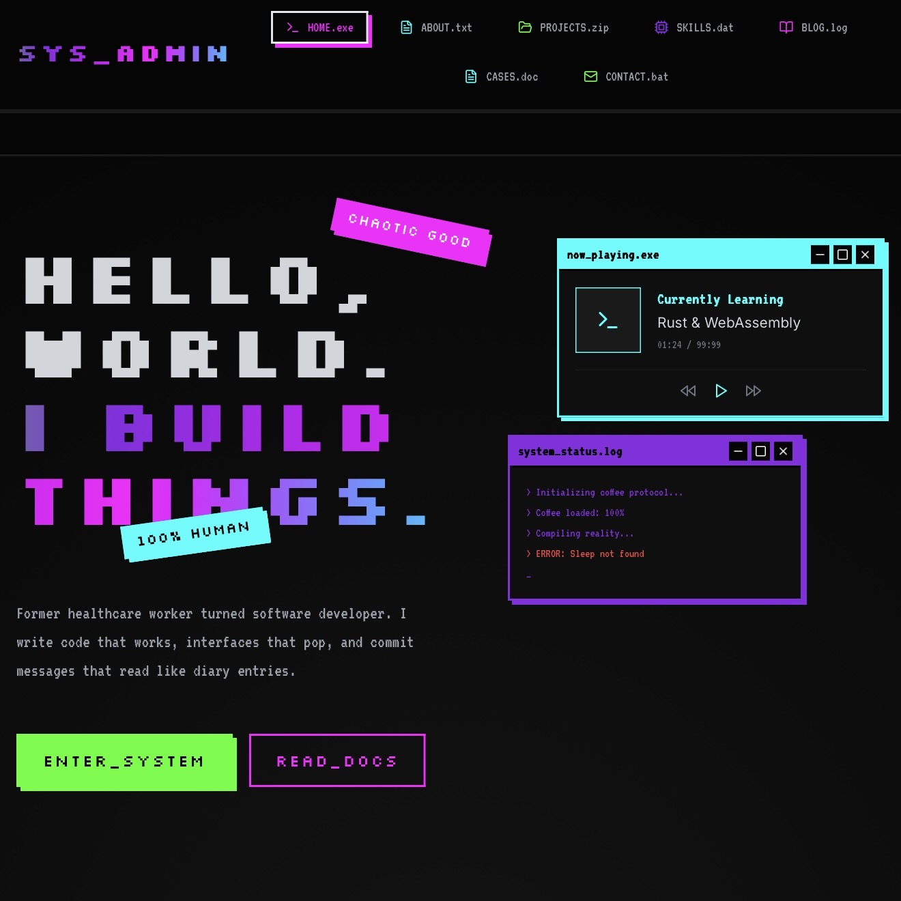](https://apursley2012.github.io/neon-retro-sys-admin/)

[Live theme](https://apursley2012.github.io/neon-retro-sys-admin/) · [Repository](https://github.com/apursley2012/neon-retro-sys-admin)

---

<a id="theme-dev-mode-arcade"></a>

<h3><a href="https://apursley2012.github.io/dev-mode-arcade/"><strong>Dev Mode Arcade</strong></a></h3>

A developer dashboard styled like an arcade control panel, combining system readouts with neon game-screen personality.

[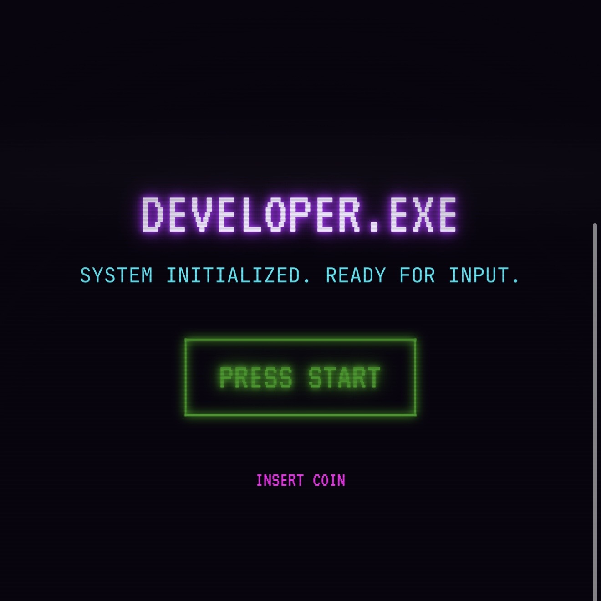](https://apursley2012.github.io/dev-mode-arcade/)

[Live theme](https://apursley2012.github.io/dev-mode-arcade/) · [Repository](https://github.com/apursley2012/dev-mode-arcade)

---

<a id="theme-player-one"></a>

<h3><a href="https://apursley2012.github.io/player-one/"><strong>Player One</strong></a></h3>

A minimal game-start portfolio that introduces the developer as Player One and invites visitors to begin exploring.

[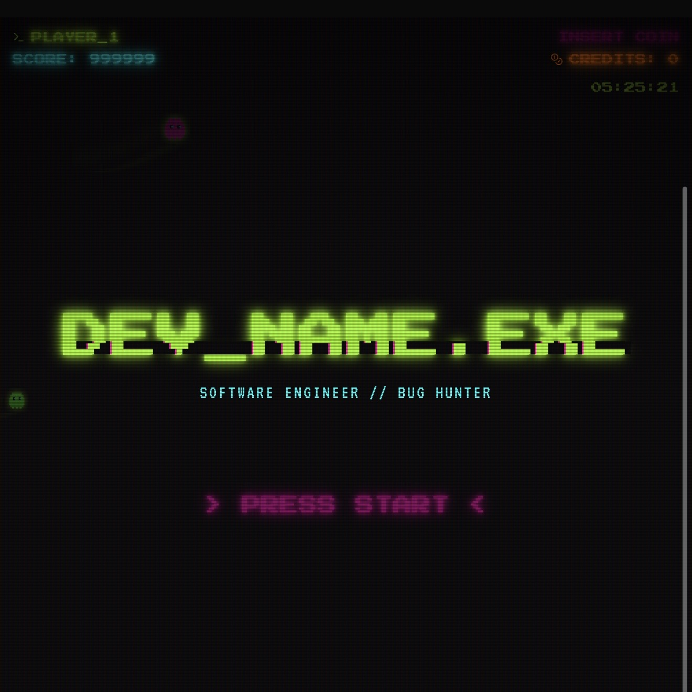](https://apursley2012.github.io/player-one/)

[Live theme](https://apursley2012.github.io/player-one/) · [Repository](https://github.com/apursley2012/player-one)

---

<a id="theme-press-start"></a>

<h3><a href="https://apursley2012.github.io/press-start/"><strong>Press Start</strong></a></h3>

A bold arcade-style landing page built around a simple start prompt, pixel energy, and direct entry into the portfolio.

[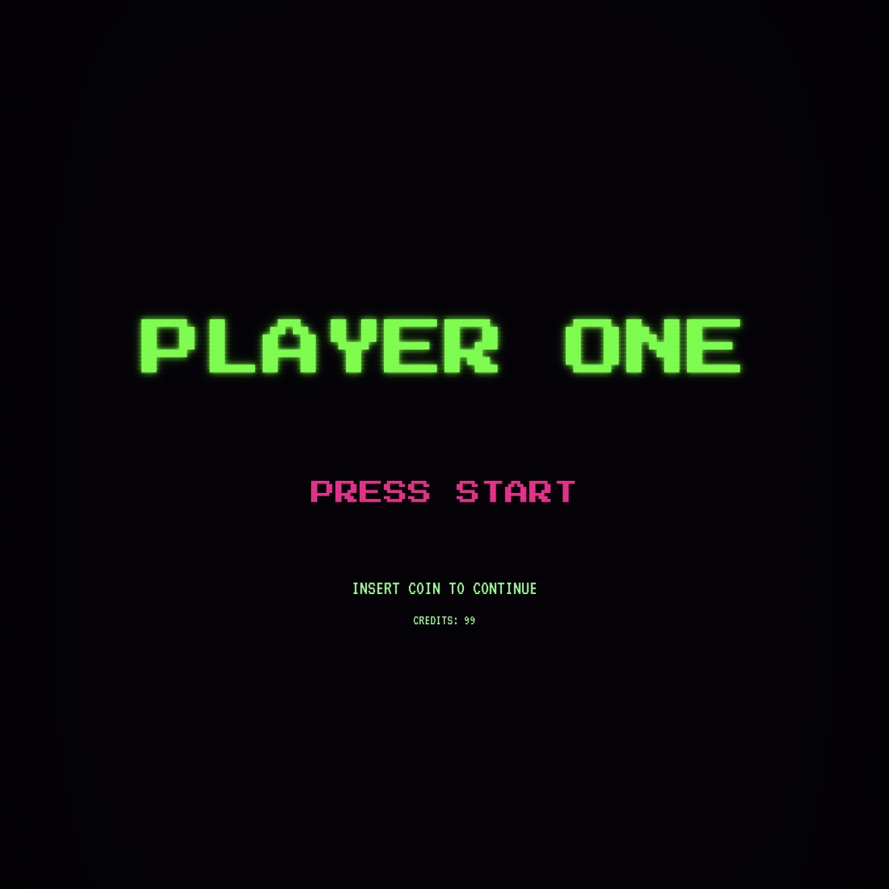](https://apursley2012.github.io/press-start/)

[Live theme](https://apursley2012.github.io/press-start/) · [Repository](https://github.com/apursley2012/press-start)

---

<a id="theme-v-doom"></a>

<h3><a href="https://apursley2012.github.io/v-doom/"><strong>V-Doom</strong></a></h3>

A dark, dramatic game-inspired portfolio with occult geometry, cinematic typography, and a heavy atmospheric introduction.

[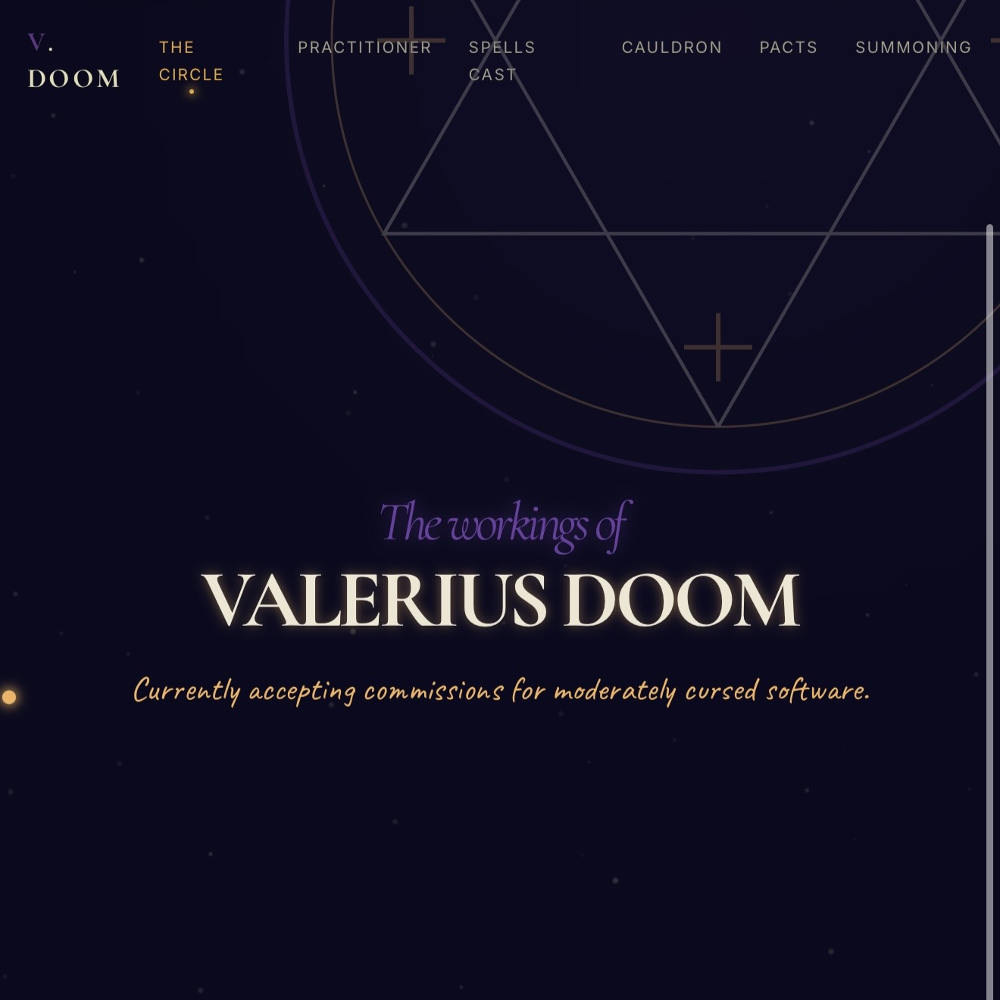](https://apursley2012.github.io/v-doom/)

[Live theme](https://apursley2012.github.io/v-doom/) · [Repository](https://github.com/apursley2012/v-doom)

---

<a id="theme-dev-arcade"></a>

<h3><a href="https://apursley2012.github.io/dev-arcade/"><strong>Dev Arcade</strong></a></h3>

A neon arcade cabinet interface that presents developer stats and project access through a compact game-menu layout.

[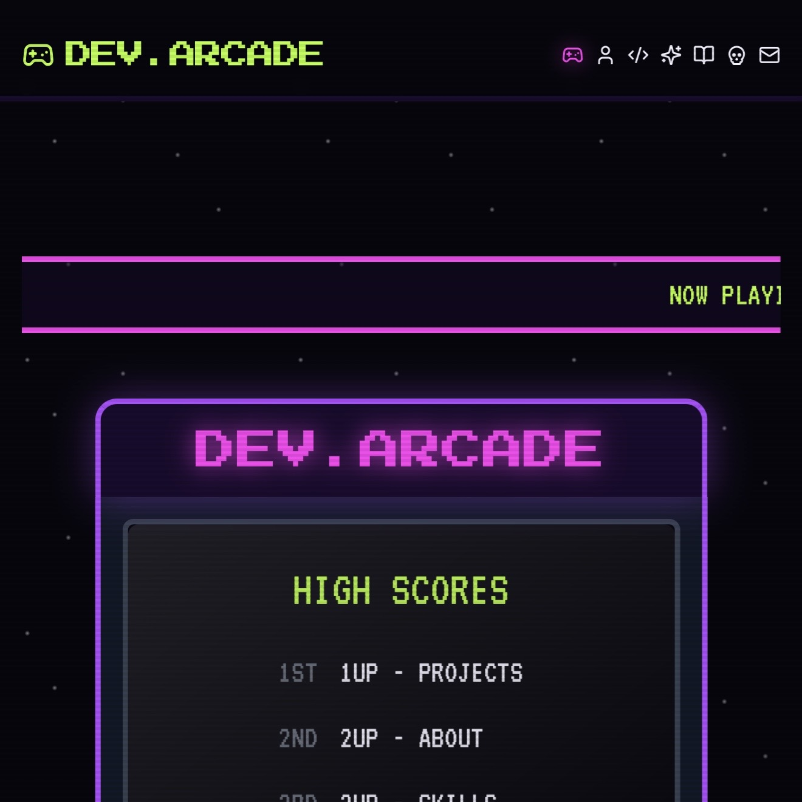](https://apursley2012.github.io/dev-arcade/)

[Live theme](https://apursley2012.github.io/dev-arcade/) · [Repository](https://github.com/apursley2012/dev-arcade)

---

<a id="space-creative"></a>

<h3><strong>Space & Creative</strong></h3>

<a id="theme-observatory"></a>

<h3><a href="https://apursley2012.github.io/observatory/"><strong>Observatory</strong></a></h3>

A cinematic observatory portfolio with starfield depth, scientific navigation, and a luminous central celestial focus.

[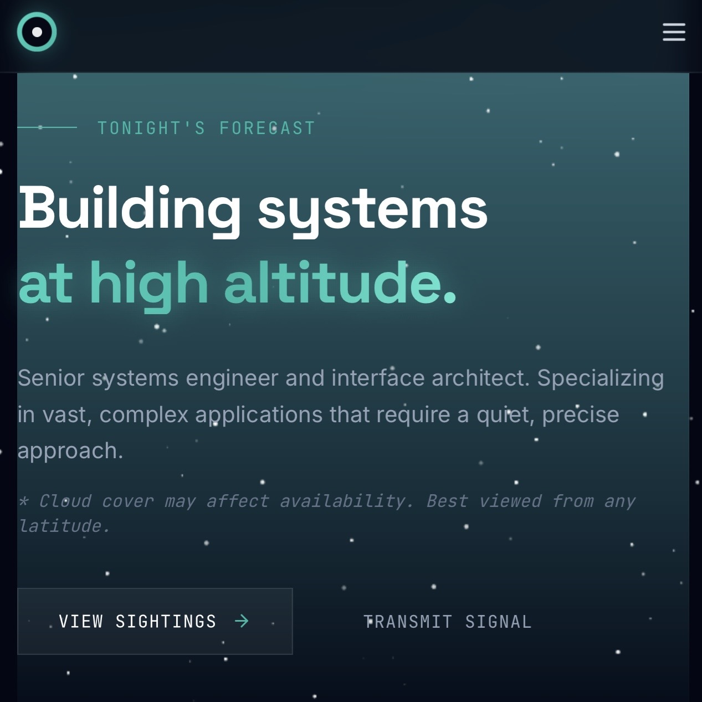](https://apursley2012.github.io/observatory/)

[Live theme](https://apursley2012.github.io/observatory/) · [Repository](https://github.com/apursley2012/observatory)

---

<a id="theme-space-mission"></a>

<h3><a href="https://apursley2012.github.io/space-mission/"><strong>Space Mission</strong></a></h3>

A mission-oriented space portfolio with orbiting elements, glowing planetary visuals, and a focused exploration narrative.

[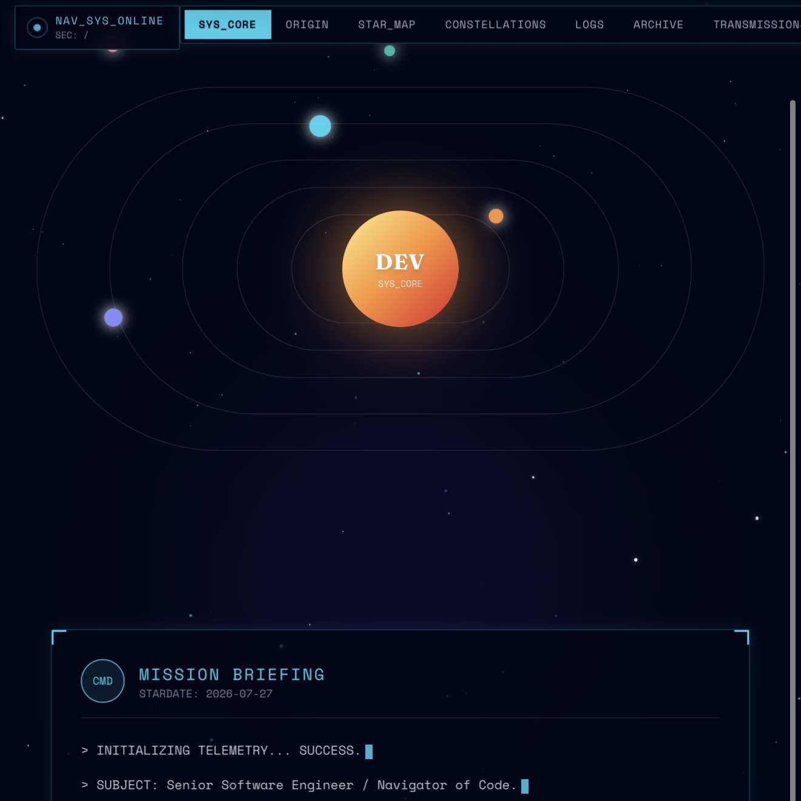](https://apursley2012.github.io/space-mission/)

[Live theme](https://apursley2012.github.io/space-mission/) · [Repository](https://github.com/apursley2012/space-mission)

---

<a id="theme-cosmic-developer"></a>

<h3><a href="https://apursley2012.github.io/cosmic-developer/"><strong>Cosmic Developer</strong></a></h3>

A spacious cosmic portfolio that frames software development as a journey through systems, projects, and technical exploration.

[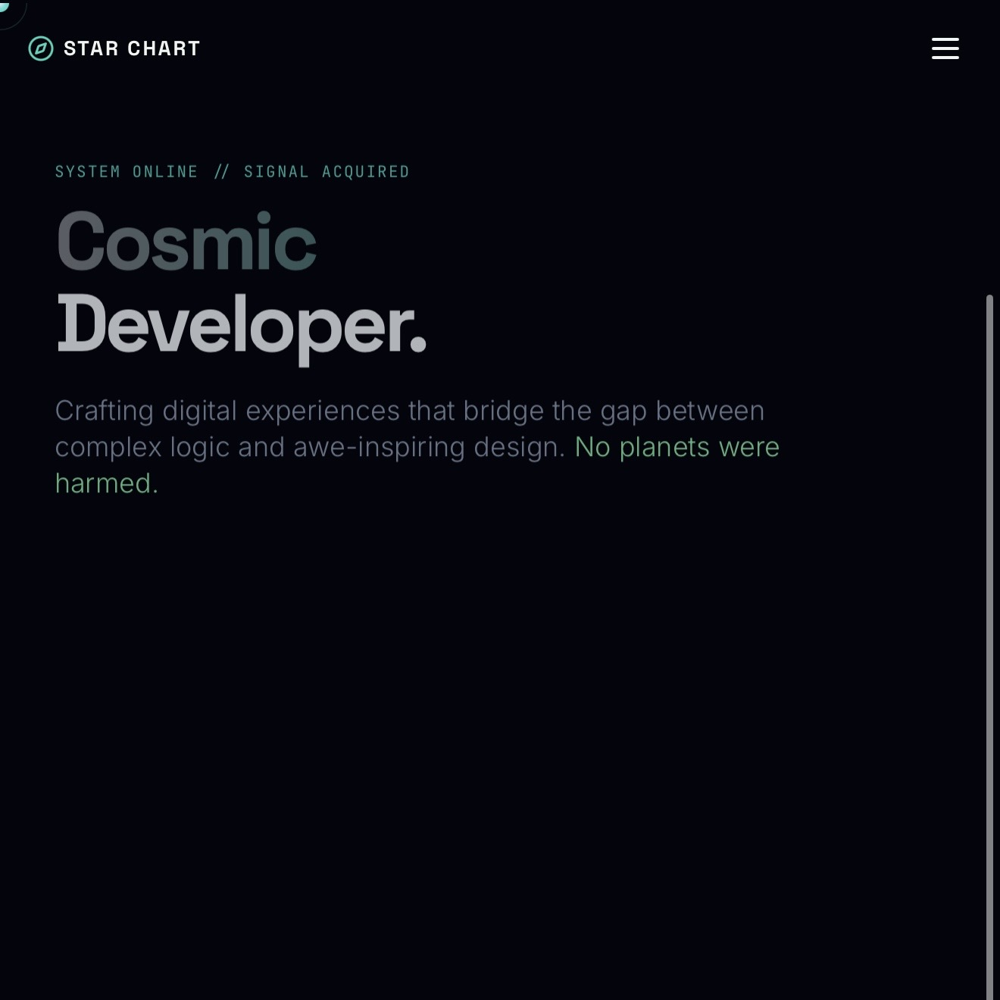](https://apursley2012.github.io/cosmic-developer/)

[Live theme](https://apursley2012.github.io/cosmic-developer/) · [Repository](https://github.com/apursley2012/cosmic-developer)

---

<a id="theme-aurora-cosmos"></a>

<h3><a href="https://apursley2012.github.io/aurora-cosmos/"><strong>Aurora Cosmos</strong></a></h3>

A calm celestial portfolio with layered aurora gradients, centered typography, and a polished deep-space atmosphere.

[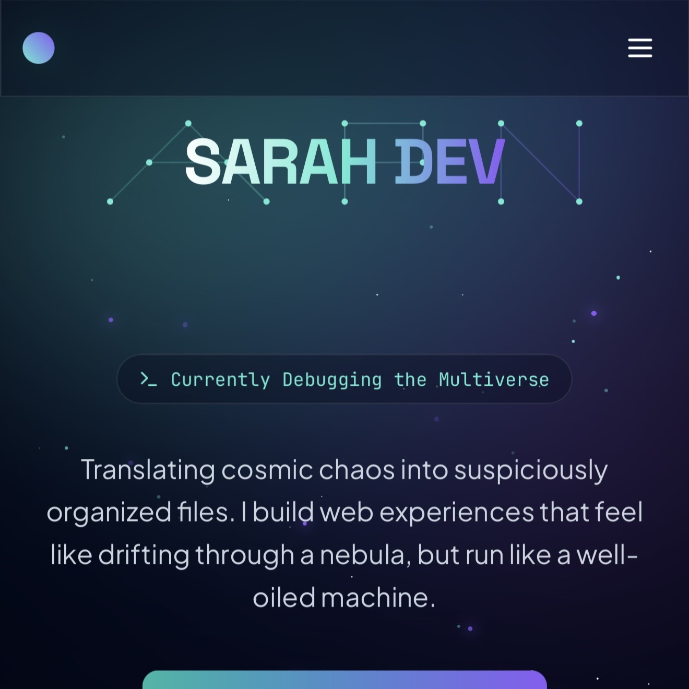](https://apursley2012.github.io/aurora-cosmos/)

[Live theme](https://apursley2012.github.io/aurora-cosmos/) · [Repository](https://github.com/apursley2012/aurora-cosmos)

---

<a id="theme-aurora-drift"></a>

<h3><a href="https://apursley2012.github.io/aurora-drift/"><strong>Aurora Drift</strong></a></h3>

A drifting aurora interface with cool luminous gradients, restrained navigation, and a smooth futuristic mood.

[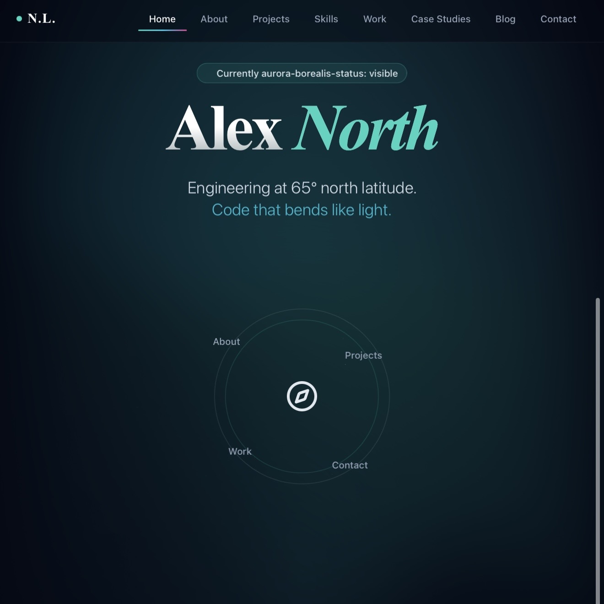](https://apursley2012.github.io/aurora-drift/)

[Live theme](https://apursley2012.github.io/aurora-drift/) · [Repository](https://github.com/apursley2012/aurora-drift)

---

<a id="theme-aurora-borealis"></a>

<h3><a href="https://apursley2012.github.io/aurora-borealis/"><strong>Aurora Borealis</strong></a></h3>

A night-sky portfolio with northern-light color, starry depth, and a refined atmospheric developer presentation.

[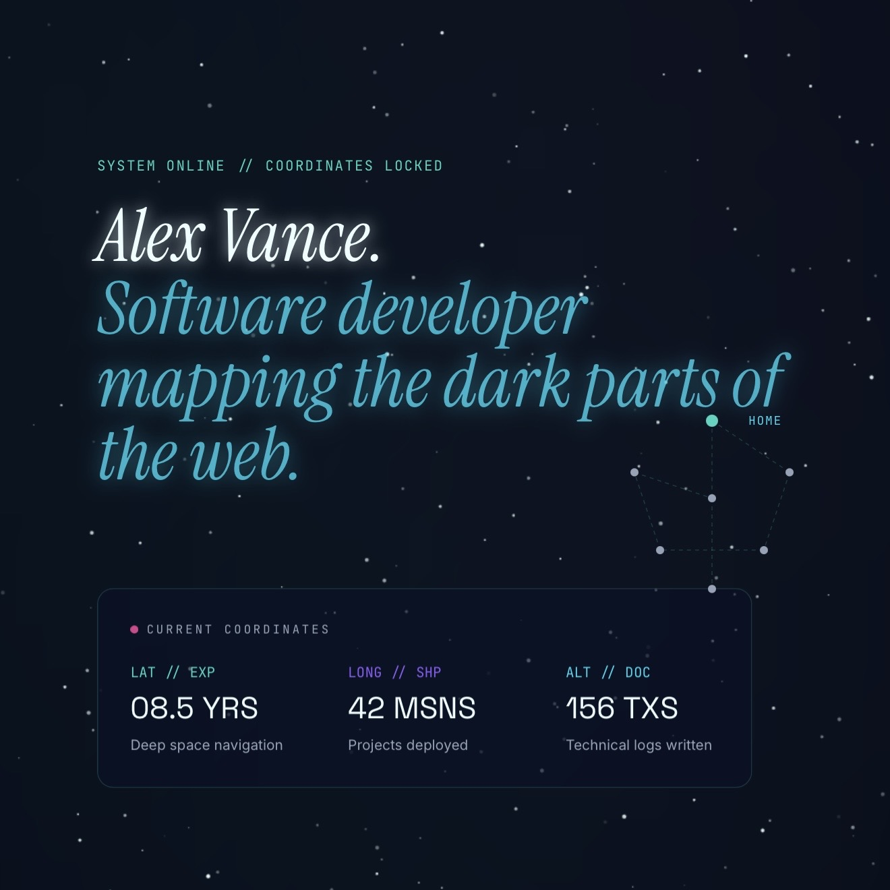](https://apursley2012.github.io/aurora-borealis/)

[Live theme](https://apursley2012.github.io/aurora-borealis/) · [Repository](https://github.com/apursley2012/aurora-borealis)

---

<a id="theme-retro-cosmic-arcade"></a>

<h3><a href="https://apursley2012.github.io/retro-cosmic-arcade/"><strong>Retro Cosmic Arcade</strong></a></h3>

A cosmic arcade portfolio with glowing rings, retro-futuristic framing, and a playful space-game identity.

[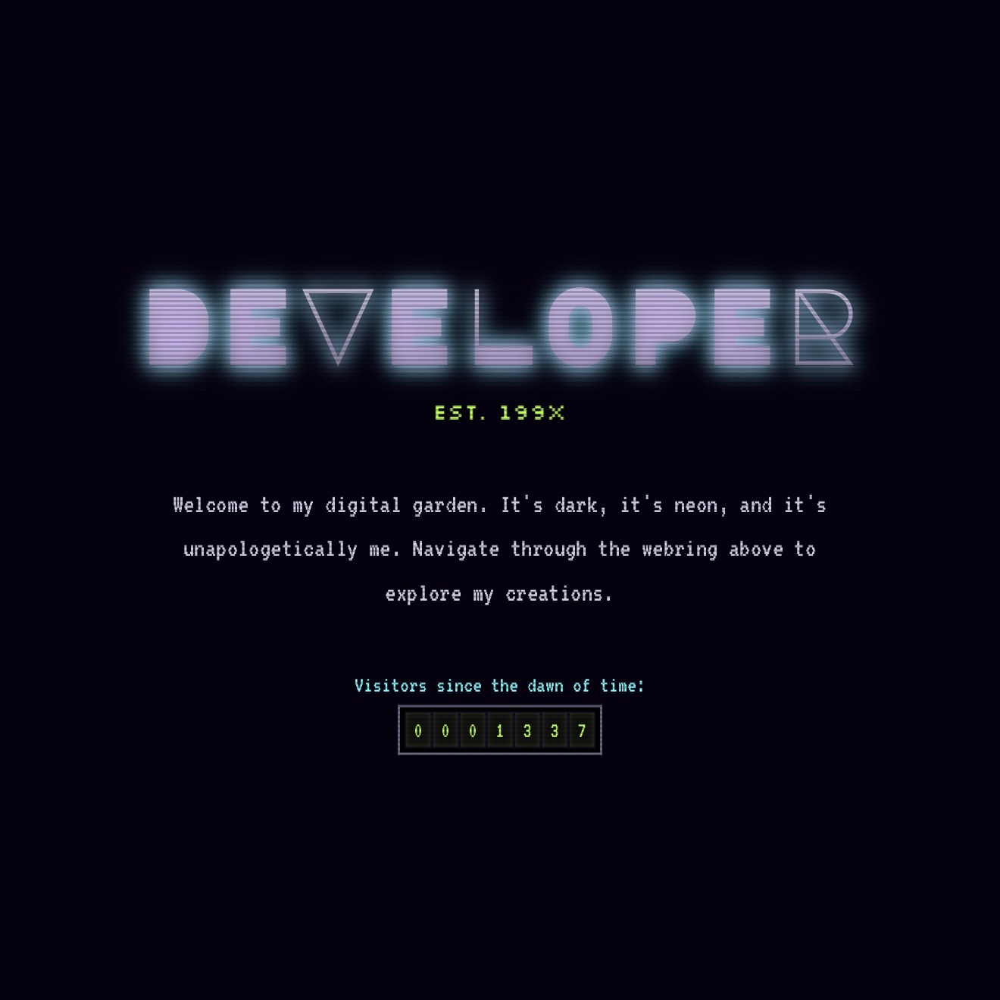](https://apursley2012.github.io/retro-cosmic-arcade/)

[Live theme](https://apursley2012.github.io/retro-cosmic-arcade/) · [Repository](https://github.com/apursley2012/retro-cosmic-arcade)

---

<a id="theme-colorful"></a>

<h3><a href="https://apursley2012.github.io/colorful/"><strong>Colorful</strong></a></h3>

A soft multicolor portfolio with large expressive typography, airy spacing, and an approachable creative personality.

[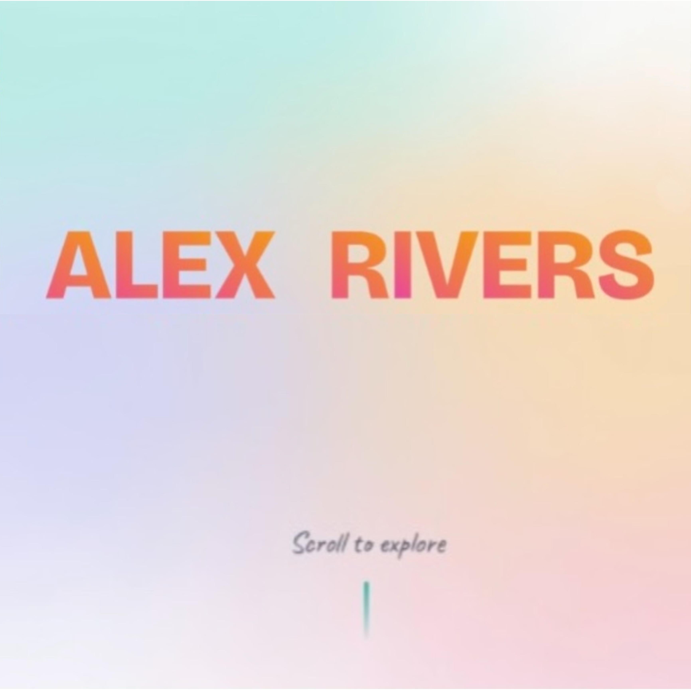](https://apursley2012.github.io/colorful/)

[Live theme](https://apursley2012.github.io/colorful/) · [Repository](https://github.com/apursley2012/colorful)

---

<a id="theme-color-melt"></a>

<h3><a href="https://apursley2012.github.io/color-melt/"><strong>Color Melt</strong></a></h3>

A bright experimental portfolio built around melting color, rounded editorial forms, and an energetic creative direction.

[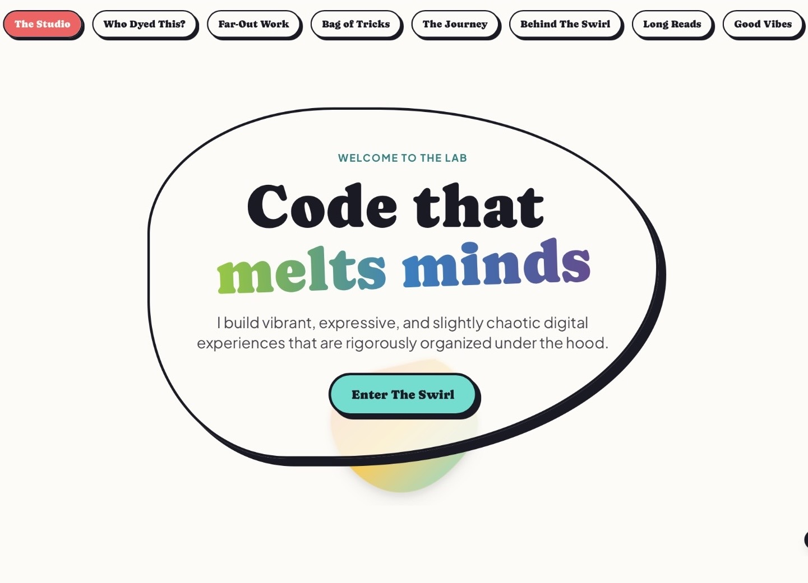](https://apursley2012.github.io/color-melt/)

[Live theme](https://apursley2012.github.io/color-melt/) · [Repository](https://github.com/apursley2012/color-melt)

---

<a id="theme-groovy"></a>

<h3><a href="https://apursley2012.github.io/groovy/"><strong>Groovy</strong></a></h3>

A cheerful retro-creative portfolio with playful lettering, sunny details, and a warm, approachable visual rhythm.

[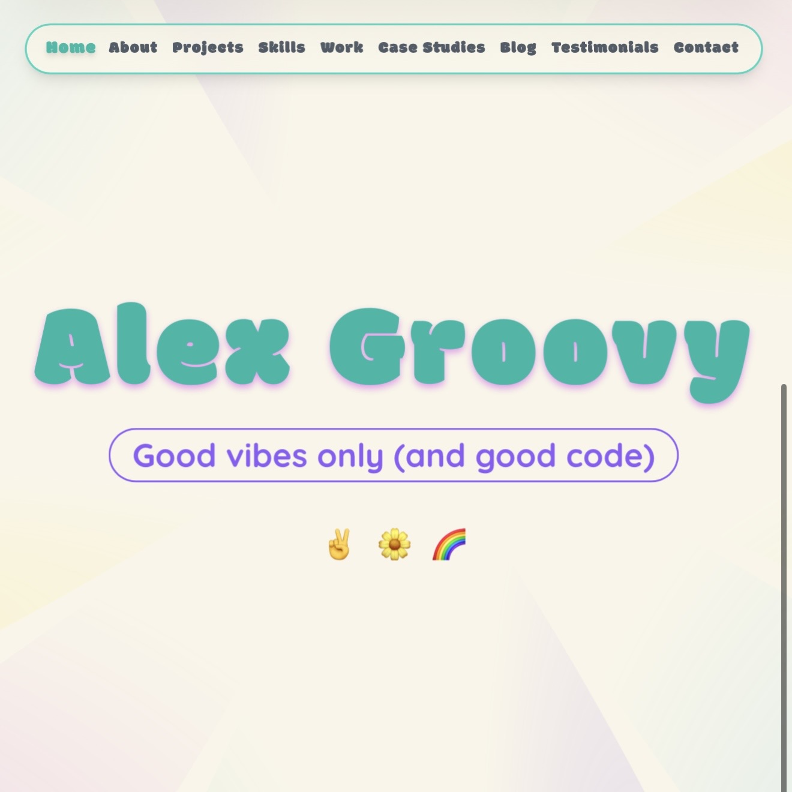](https://apursley2012.github.io/groovy/)

[Live theme](https://apursley2012.github.io/groovy/) · [Repository](https://github.com/apursley2012/groovy)

---

<a id="theme-dyed-in-the-wool"></a>

<h3><a href="https://apursley2012.github.io/dyed-in-the-wool/"><strong>Dyed in the Wool</strong></a></h3>

A textile-inspired portfolio with soft dyed color, handcrafted typography, and a polished studio-made feeling.

[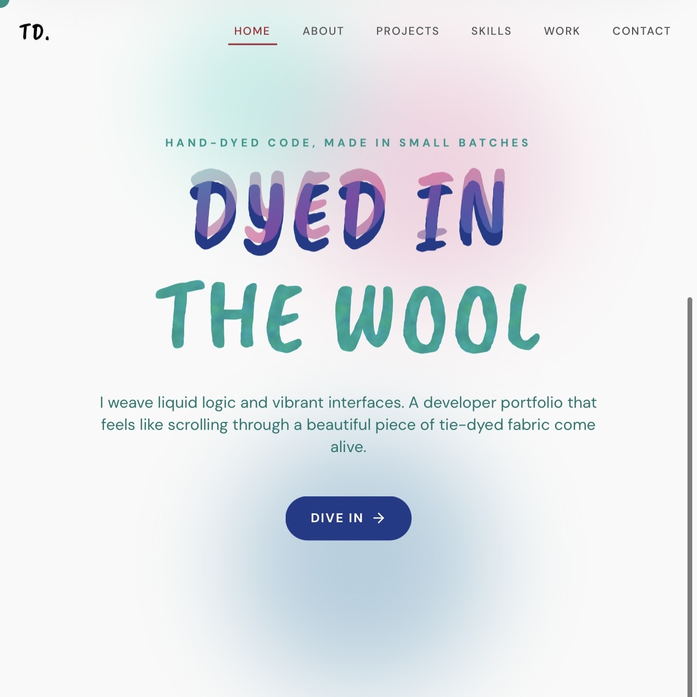](https://apursley2012.github.io/dyed-in-the-wool/)

[Live theme](https://apursley2012.github.io/dyed-in-the-wool/) · [Repository](https://github.com/apursley2012/dyed-in-the-wool)

---

<a id="spooky-magical"></a>

<h3><strong>Spooky & Magical</strong></h3>

<a id="theme-oracle"></a>

<h3><a href="https://apursley2012.github.io/oracle/"><strong>Oracle</strong></a></h3>

A dark divination portfolio with glowing circular symbols, layered cards, and a focused seek-your-fortune interaction.

[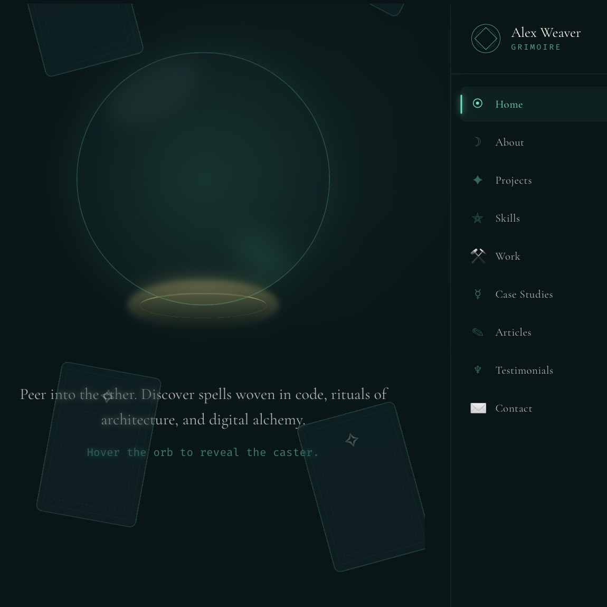](https://apursley2012.github.io/oracle/)

[Live theme](https://apursley2012.github.io/oracle/) · [Repository](https://github.com/apursley2012/oracle)

---

<a id="theme-full-stack-sorcerer"></a>

<h3><a href="https://apursley2012.github.io/full-stack-sorcerer/"><strong>Full-Stack Sorcerer</strong></a></h3>

A magical full-stack portfolio that presents technical skills as organized schools of sorcery within a refined dark interface.

[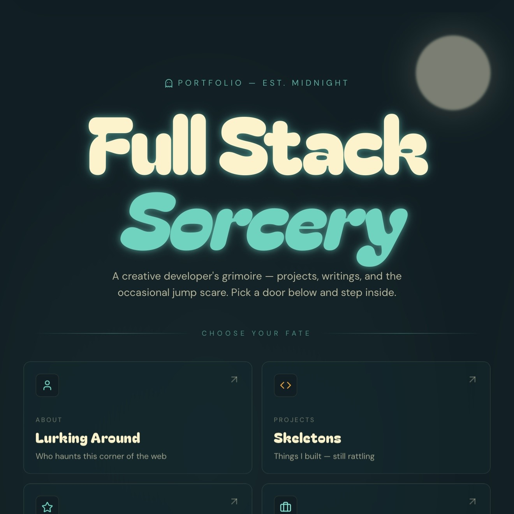](https://apursley2012.github.io/full-stack-sorcerer/)

[Live theme](https://apursley2012.github.io/full-stack-sorcerer/) · [Repository](https://github.com/apursley2012/full-stack-sorcerer)

---

<a id="theme-digital-alchemy"></a>

<h3><a href="https://apursley2012.github.io/digital-alchemy/"><strong>Digital Alchemy</strong></a></h3>

An arcane developer portfolio with geometric ritual symbols, candlelit details, and a sophisticated digital-alchemist identity.

[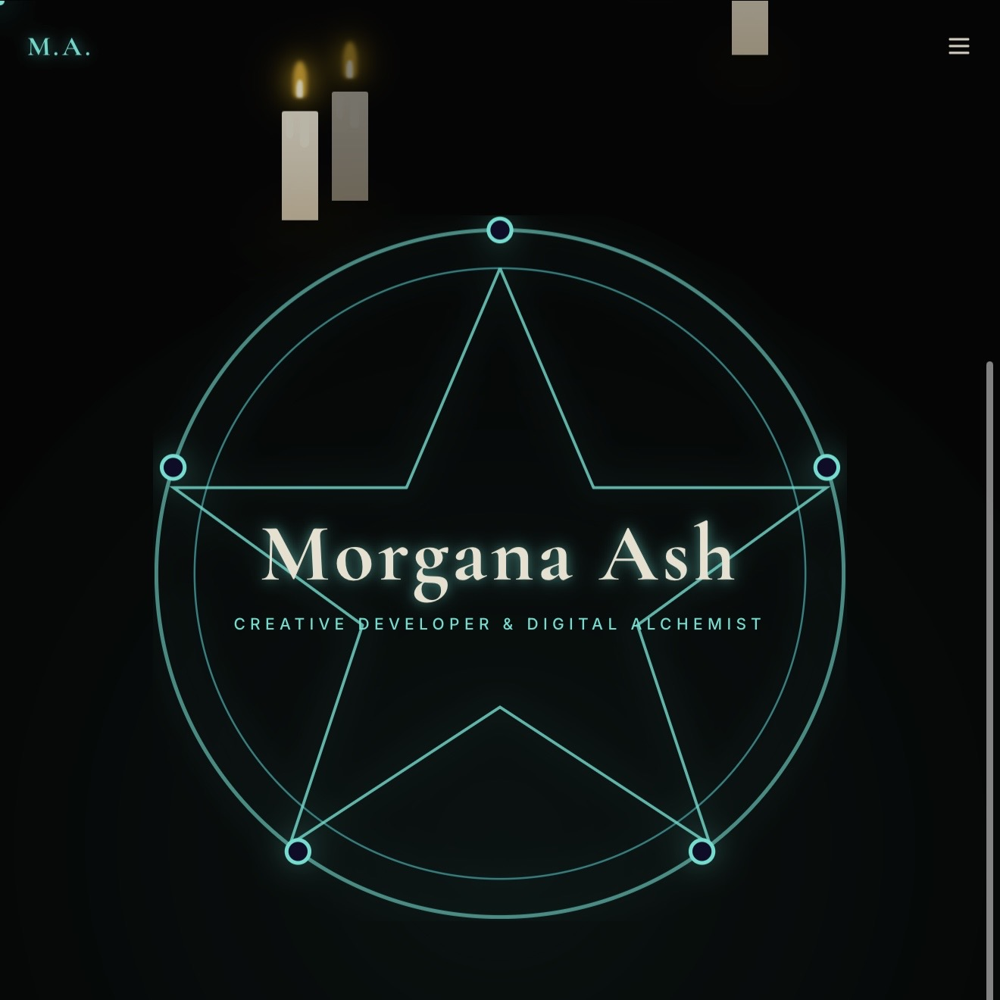](https://apursley2012.github.io/digital-alchemy/)

[Live theme](https://apursley2012.github.io/digital-alchemy/) · [Repository](https://github.com/apursley2012/digital-alchemy)

---

<a id="theme-digital-coven"></a>

<h3><a href="https://apursley2012.github.io/digital-coven/"><strong>Digital Coven</strong></a></h3>

A dramatic coven-inspired portfolio with bold mystical typography, dark gradients, and a choice-driven introduction.

[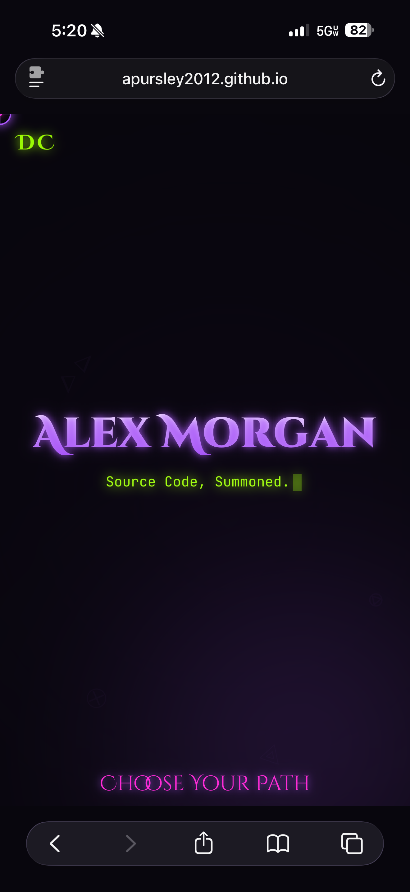](https://apursley2012.github.io/digital-coven/)

[Live theme](https://apursley2012.github.io/digital-coven/) · [Repository](https://github.com/apursley2012/digital-coven)

---

<a id="theme-systems-witch"></a>

<h3><a href="https://apursley2012.github.io/systems-witch/"><strong>Systems Witch</strong></a></h3>

A systems-focused witch portfolio that combines terminal structure, geometric spellwork, and luminous green technical accents.

[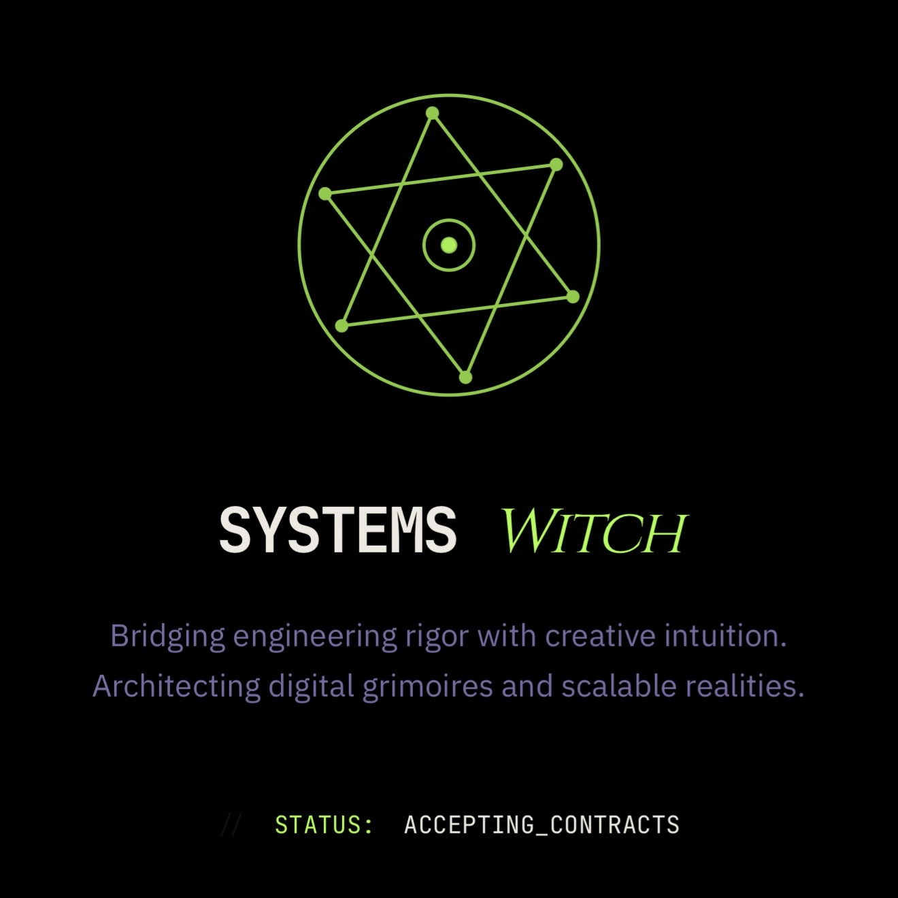](https://apursley2012.github.io/systems-witch/)

[Live theme](https://apursley2012.github.io/systems-witch/) · [Repository](https://github.com/apursley2012/systems-witch)

---

<a id="theme-sys-witch"></a>

<h3><a href="https://apursley2012.github.io/sys-witch/"><strong>Sys-Witch</strong></a></h3>

A cosmic witch-tech portfolio with orbiting interface nodes, glowing purple details, and a compact central identity.

[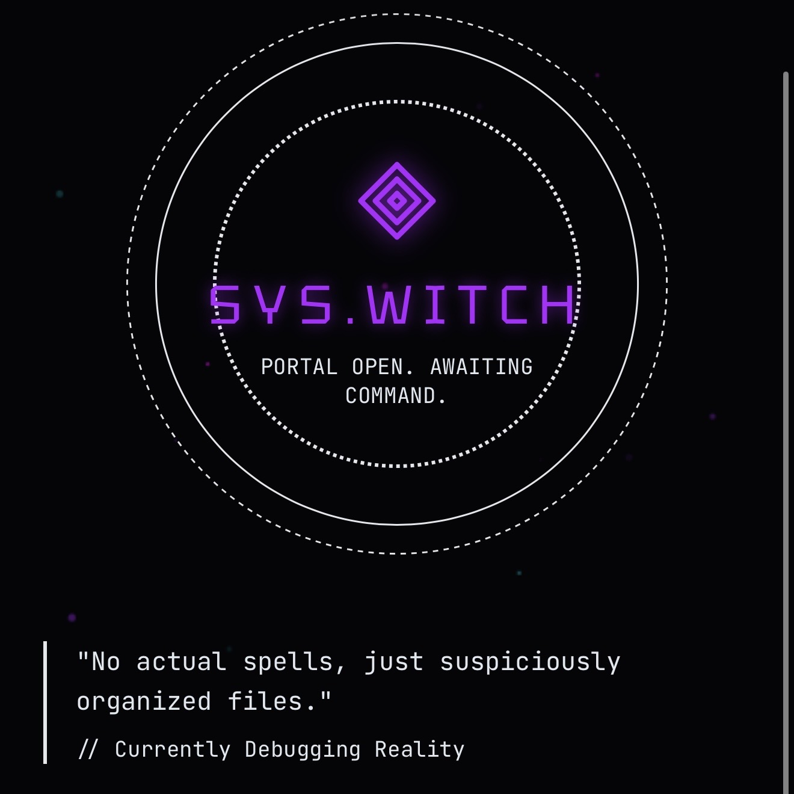](https://apursley2012.github.io/sys-witch/)

[Live theme](https://apursley2012.github.io/sys-witch/) · [Repository](https://github.com/apursley2012/sys-witch)

---

<a id="theme-witch-dev"></a>

<h3><a href="https://apursley2012.github.io/witch-dev/"><strong>Witch Dev</strong></a></h3>

A mystical developer portfolio centered on circular spellwork, vivid neon accents, and a strong personal introduction.

[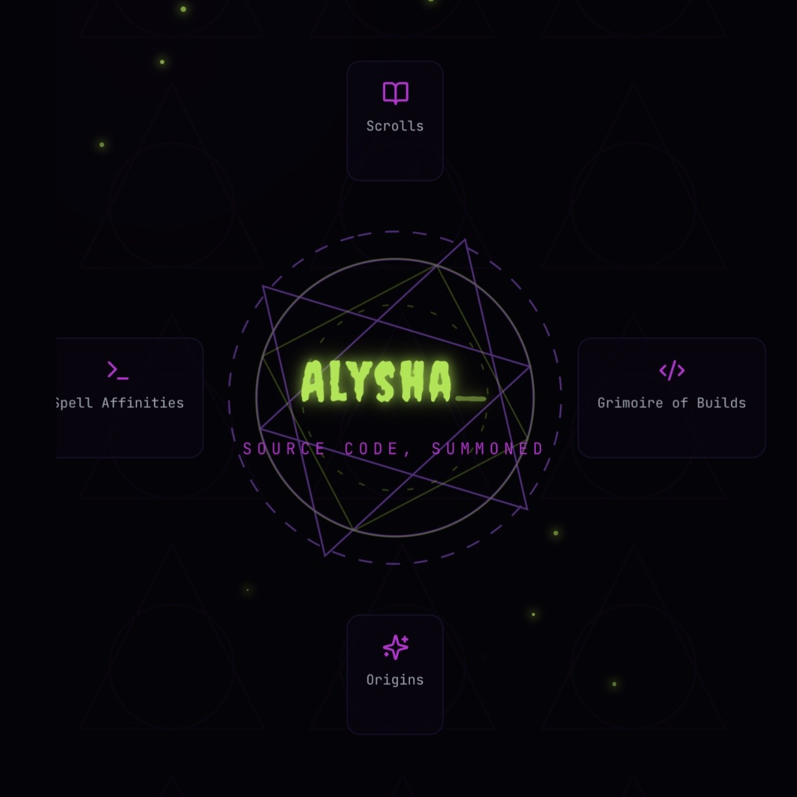](https://apursley2012.github.io/witch-dev/)

[Live theme](https://apursley2012.github.io/witch-dev/) · [Repository](https://github.com/apursley2012/witch-dev)

---

<a id="theme-the-craft"></a>

<h3><a href="https://apursley2012.github.io/the-craft/"><strong>The Craft</strong></a></h3>

A dark editorial portfolio with an atmospheric focal image, restrained typography, and a cinematic occult mood.

[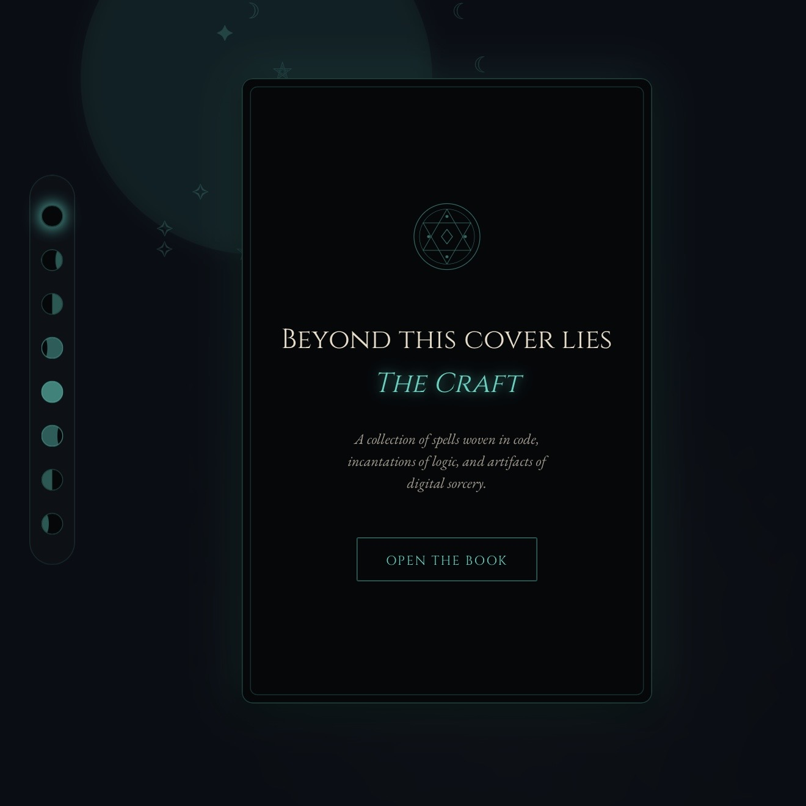](https://apursley2012.github.io/the-craft/)

[Live theme](https://apursley2012.github.io/the-craft/) · [Repository](https://github.com/apursley2012/the-craft)

---

<a id="theme-spell-index"></a>

<h3><a href="https://apursley2012.github.io/spell-index/"><strong>Spell Index</strong></a></h3>

A grimoire-inspired portfolio organized like a searchable spell catalog, with clear sections and refined mystical details.

[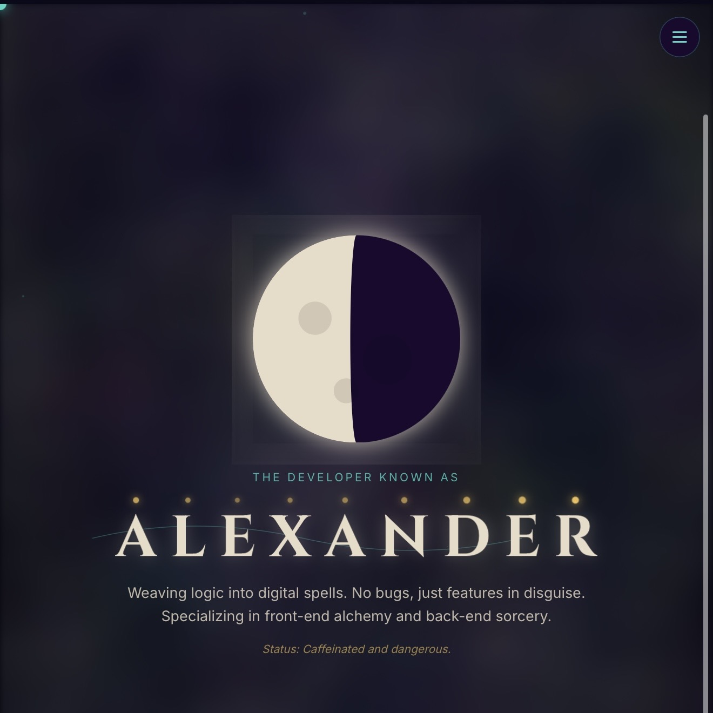](https://apursley2012.github.io/spell-index/)

[Live theme](https://apursley2012.github.io/spell-index/) · [Repository](https://github.com/apursley2012/spell-index)

---

<a id="theme-sorcerer"></a>

<h3><a href="https://apursley2012.github.io/sorcerer/"><strong>Sorcerer</strong></a></h3>

A refined dark-magic portfolio with elegant typography, geometric atmosphere, and a polished character-driven introduction.

[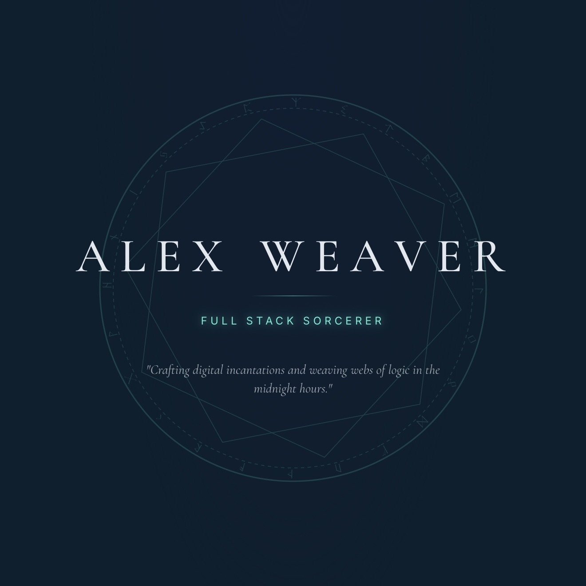](https://apursley2012.github.io/sorcerer/)

[Live theme](https://apursley2012.github.io/sorcerer/) · [Repository](https://github.com/apursley2012/sorcerer)

---

<a id="theme-full-moon"></a>

<h3><a href="https://apursley2012.github.io/full-moon/"><strong>Full Moon</strong></a></h3>

A moonlit portfolio with deep blue-green color, quiet glowing details, and a calm nocturnal developer presence.

[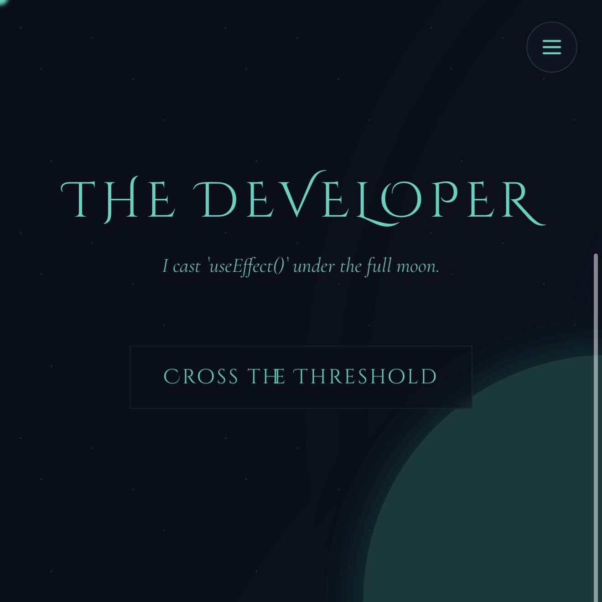](https://apursley2012.github.io/full-moon/)

[Live theme](https://apursley2012.github.io/full-moon/) · [Repository](https://github.com/apursley2012/full-moon)

---

<a id="theme-fortune-seeker"></a>

<h3><a href="https://apursley2012.github.io/fortune-seeker/"><strong>Fortune Seeker</strong></a></h3>

A card-reading portfolio that invites visitors to uncover work and experience through a mysterious centered interaction.

[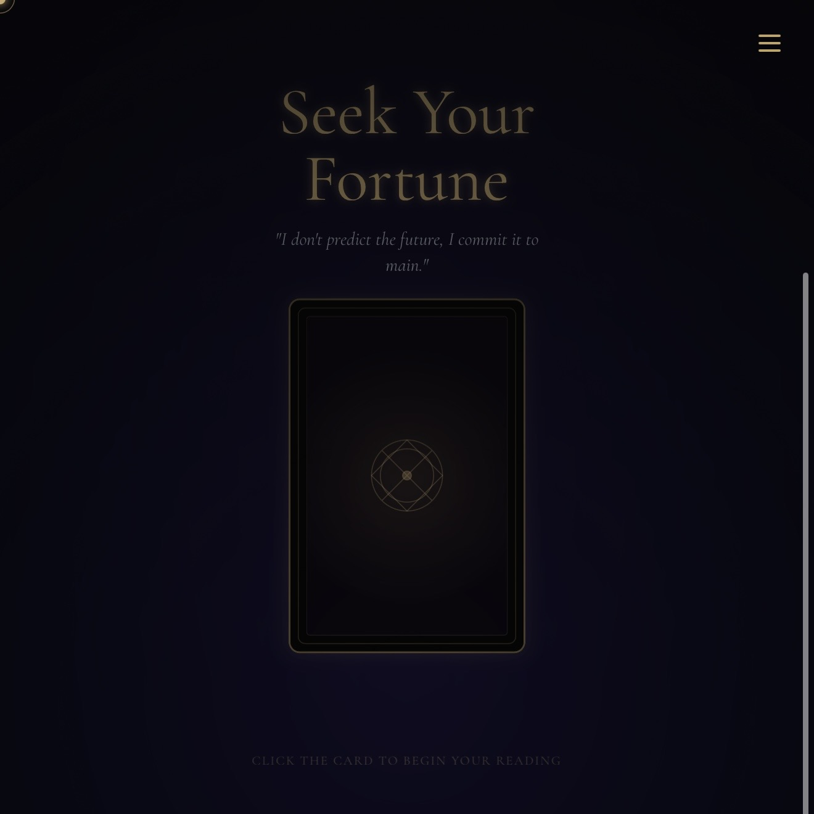](https://apursley2012.github.io/fortune-seeker/)

[Live theme](https://apursley2012.github.io/fortune-seeker/) · [Repository](https://github.com/apursley2012/fortune-seeker)

---

<a id="theme-magical"></a>

<h3><a href="https://apursley2012.github.io/magical/"><strong>Magical</strong></a></h3>

A soft enchanted portfolio with luminous cards, purple night colors, and a welcoming storybook atmosphere.

[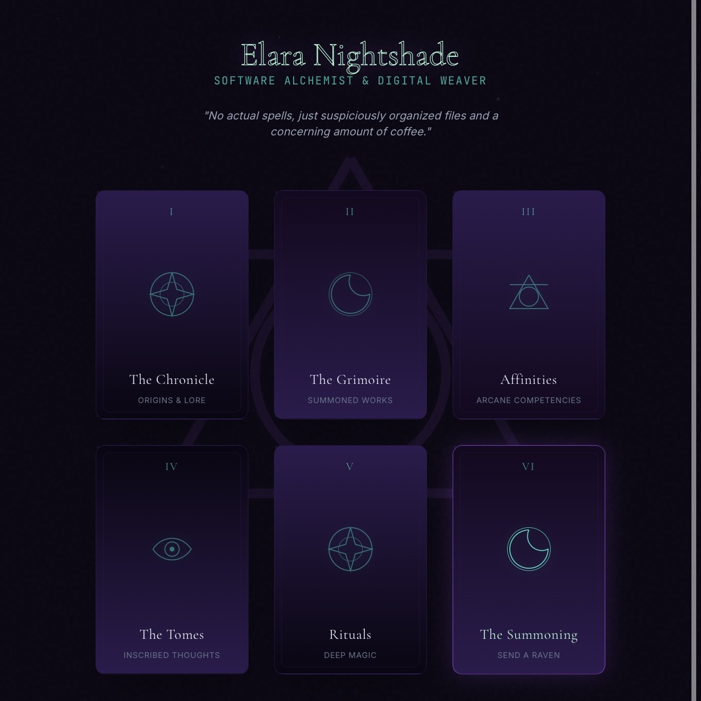](https://apursley2012.github.io/magical/)

[Live theme](https://apursley2012.github.io/magical/) · [Repository](https://github.com/apursley2012/magical)

---

<a id="theme-dev-haunt"></a>

<h3><a href="https://apursley2012.github.io/dev-haunt/"><strong>Dev Haunt</strong></a></h3>

A haunted-house developer portfolio with moonlit scenery, warm window glow, and playful supernatural storytelling.

[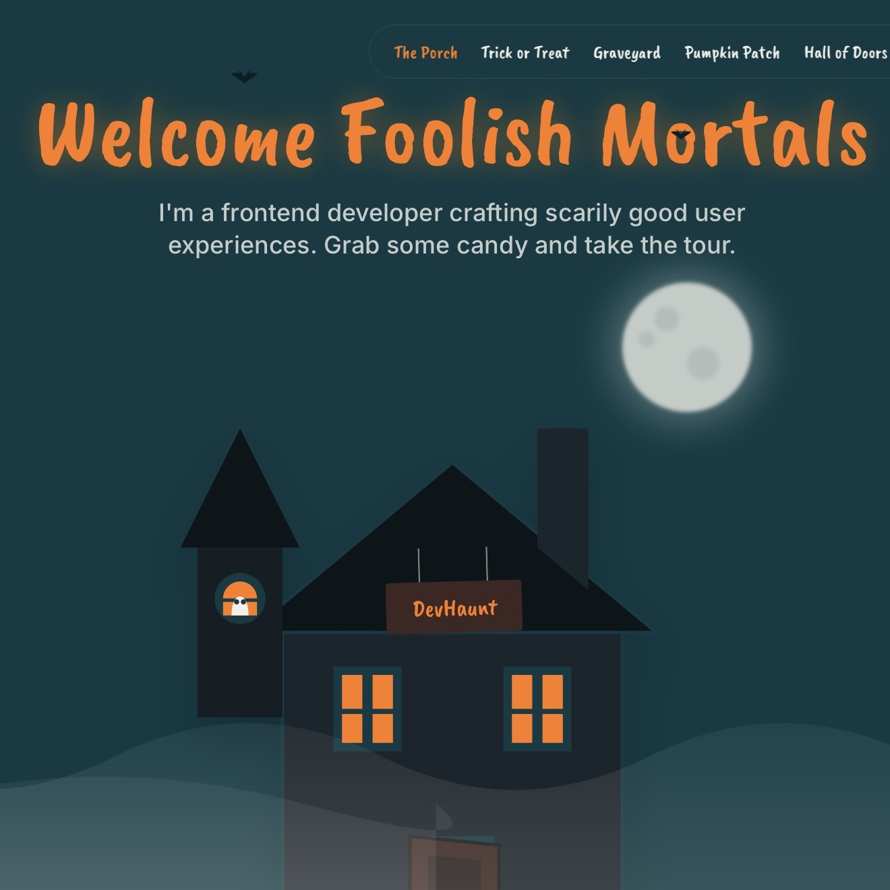](https://apursley2012.github.io/dev-haunt/)

[Live theme](https://apursley2012.github.io/dev-haunt/) · [Repository](https://github.com/apursley2012/dev-haunt)

---

<a id="theme-spooky"></a>

<h3><a href="https://apursley2012.github.io/spooky/"><strong>Spooky</strong></a></h3>

A Halloween portfolio with a dark doorway, floating lights, and a compact invitation into an eerie interactive space.

[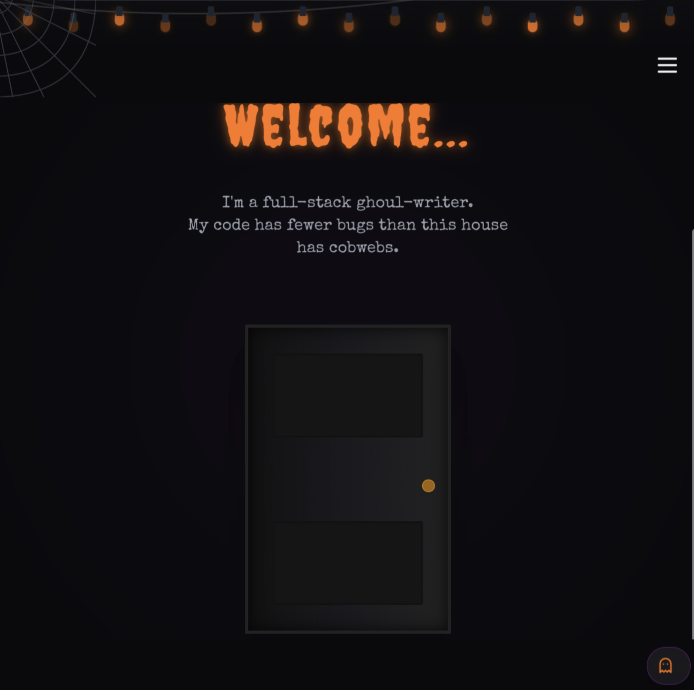](https://apursley2012.github.io/spooky/)

[Live theme](https://apursley2012.github.io/spooky/) · [Repository](https://github.com/apursley2012/spooky)

---

<a id="theme-spooky-developer"></a>

<h3><a href="https://apursley2012.github.io/spooky-developer/"><strong>Spooky Developer</strong></a></h3>

A playful haunted portfolio with tombstone navigation, a small glowing house, and a friendly spooky developer identity.

[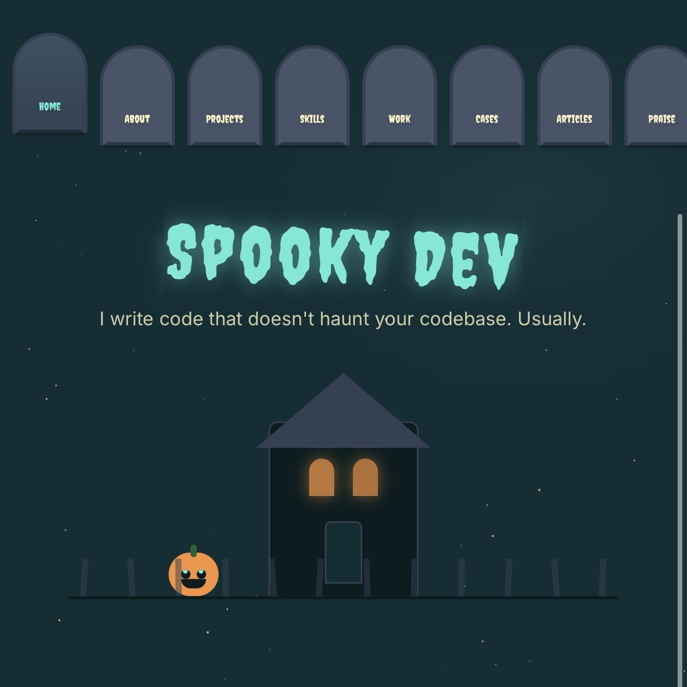](https://apursley2012.github.io/spooky-developer/)

[Live theme](https://apursley2012.github.io/spooky-developer/) · [Repository](https://github.com/apursley2012/spooky-developer)

---

<a id="theme-mystery-haunting"></a>

<h3><a href="https://apursley2012.github.io/mystery-haunting/"><strong>Mystery Haunting</strong></a></h3>

A story-driven haunted portfolio with a looming house silhouette, side navigation, and an atmospheric mystery presentation.

[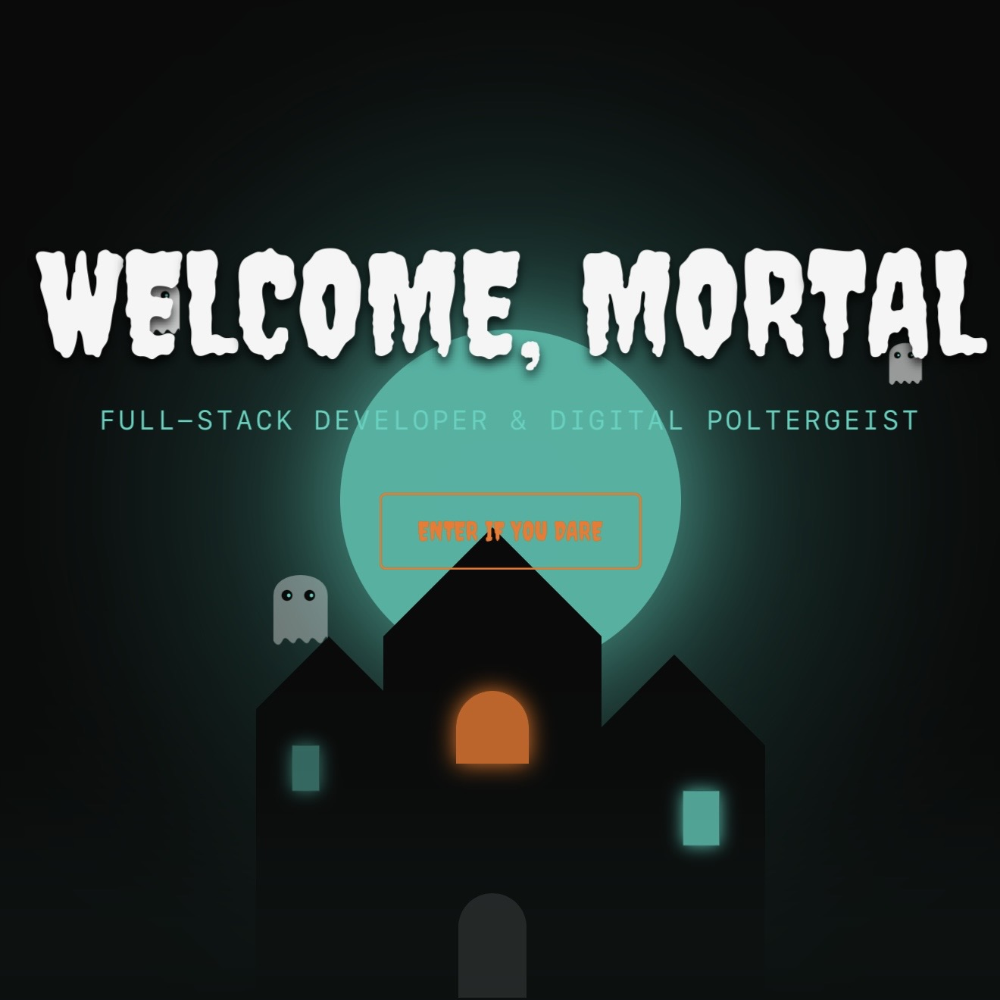](https://apursley2012.github.io/mystery-haunting/)

[Live theme](https://apursley2012.github.io/mystery-haunting/) · [Repository](https://github.com/apursley2012/mystery-haunting)

---

<a id="theme-welcome-mortals"></a>

<h3><a href="https://apursley2012.github.io/welcome-mortals/"><strong>Welcome Mortals</strong></a></h3>

A theatrical haunted-house portfolio with a bold mortal greeting, moonlit scenery, and immersive supernatural personality.

[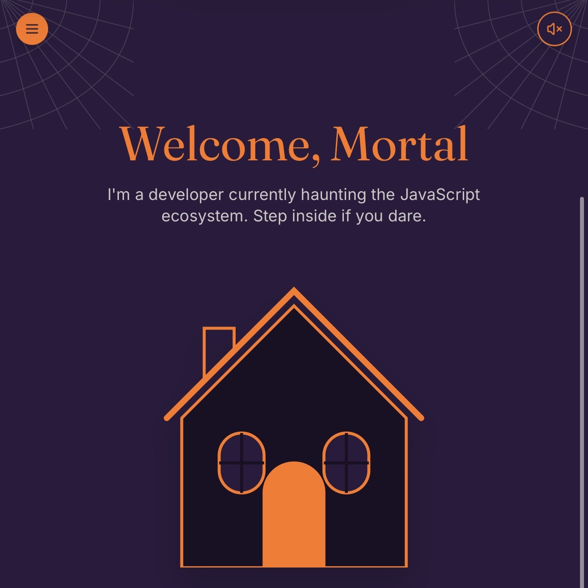](https://apursley2012.github.io/welcome-mortals/)

[Live theme](https://apursley2012.github.io/welcome-mortals/) · [Repository](https://github.com/apursley2012/welcome-mortals)

---

<a id="theme-nightshade"></a>

<h3><a href="https://apursley2012.github.io/nightshade/"><strong>Nightshade</strong></a></h3>

A dark botanical and mystical portfolio with elegant typography, constellation-like geometry, and a restrained nocturnal palette.

[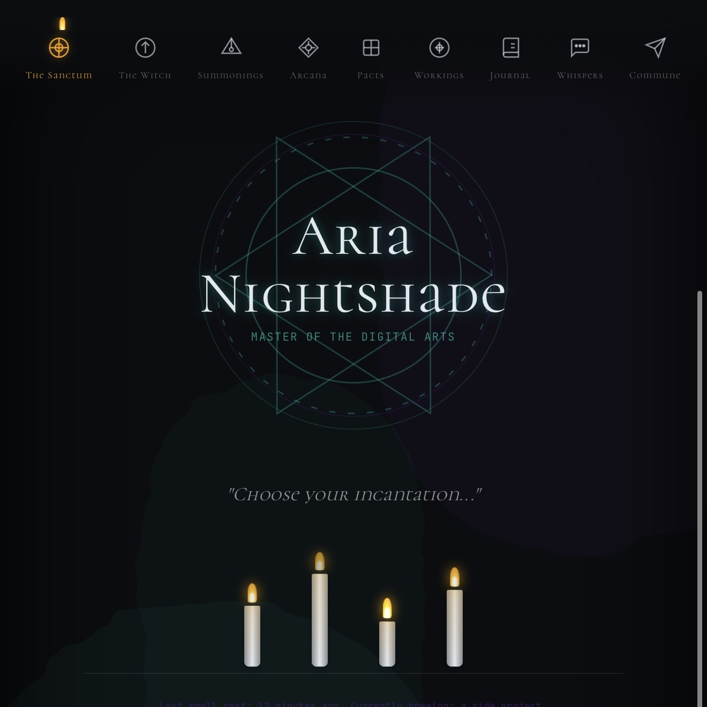](https://apursley2012.github.io/nightshade/)

[Live theme](https://apursley2012.github.io/nightshade/) · [Repository](https://github.com/apursley2012/nightshade)

</div>

</details>

</details>
<a id="collection-relationship"></a>

<details open>
<summary><h2><strong>Collection Relationship 🗞️</strong></h2></summary>


Theme Bulletin is the directory, not the source repository for every theme. The gallery stores the metadata needed to browse the collection and links outward to each standalone theme repository. That separation means one theme can be updated, repaired, or documented without forcing the entire collection into one shared build.

Unavailable themes are kept visible when that status is useful. Instead of fabricating a preview or silently removing the entry, Theme Bulletin can mark a theme for manual review until its source files are restored.

</details>

---

<a id="customization-guide"></a>

<details open>
<summary><h2><strong>Customization Guide 🎨</strong></h2></summary>


The safest way to customize or extend **Theme Bulletin** is to preserve its existing workflow first, then change one layer at a time. Update project content and data in the files that already own that information, keep visual changes inside the existing style system, and test every page that shares the changed component or data source. New features should solve a problem that belongs to this project instead of copying a feature from an unrelated application.

For visual changes, update the documented palette intentionally and re-check contrast, responsive spacing, screenshots, and any state colors that depend on the same variables. For data or logic changes, test both the normal path and empty/error/edge cases before publishing.

</details>

---

<a id="accessibility-and-browser-compatibility"></a>

<details open>
<summary><h2><strong>Accessibility and Browser Compatibility ♿</strong></h2></summary>


The public interface should remain keyboard-navigable, readable at common mobile and desktop widths, and usable without relying on color alone to communicate state. Form controls should keep visible labels or accessible names, images should use meaningful `alt` text, focus indicators should remain visible, and decorative animation should respect reduced-motion preferences when motion is present. Browser compatibility should be checked in current Safari, Chrome, Firefox, and Edge where practical.

</details>

---

<a id="repository-relationship"></a>

<details open>
<summary><h2><strong>Repository Relationship 🔗</strong></h2></summary>


**Theme Bulletin** is documented as its own project. Supporting case studies, articles, source history, static presentation layers, or backend/runtime folders are parts of this repository only when they help explain or run this project. They should not be described as separate replacement projects.

Where this repository contains both a static GitHub Pages layer and source that requires another runtime, the two are related but not interchangeable: the static layer provides the public experience that can run in a browser, while the source/runtime layer preserves functionality that GitHub Pages cannot execute directly.

</details>

---

<a id="project-scope-and-limitations"></a>

<details open>
<summary><h2><strong>Project Scope and Limitations 📌</strong></h2></summary>


This README separates what the published browser version can do from functionality that belongs to a backend, database, native application, notebook, or other runtime. Static hosting limitations are stated where they materially affect the project. The documentation should not imply that GitHub Pages is providing server-side authentication, Python execution, MongoDB access, SMS delivery, or another service it cannot actually run.

</details>

---

<a id="possible-future-enhancements"></a>

<details open>
<summary><h2><strong>Possible Future Enhancements 💡</strong></h2></summary>


*   Add automated validation for every live-demo and repository link
*   Refresh preview images whenever individual themes change
*   Add richer filtering without making the bulletin board feel like a conventional database table
*   Keep unavailable-theme status synchronized with the actual source repositories

</details>

---

<a id="contributing"></a>

<details open>
<summary><h2><strong>Contributing 🤝</strong></h2></summary>


Contributions, bug reports, and practical improvement suggestions are welcome when they preserve the existing project direction and do not replace its identity with a generic redesign.

</details>

<a id="reporting-issues"></a>

<details open>
<summary><h3><strong>Reporting Issues 🐛</strong></h3></summary>


When reporting a problem, include the page or workflow involved, what you expected, what actually happened, browser/device information when relevant, and a screenshot if the issue is visual.

</details>

<a id="requesting-additions"></a>

<details open>
<summary><h3><strong>Requesting Additions 📝</strong></h3></summary>


Feature requests should explain the user problem the addition would solve and how it fits the existing project. Project-specific improvements are preferred over adding features only because they are common in other applications.

</details>

---

<a id="license"></a>

<details open>
<summary><h2><strong>License 📜</strong></h2></summary>


No license terms are assumed here. If the repository includes a `LICENSE` file, that file controls reuse. If it does not, normal copyright applies and permission should not be inferred from the repository being public.

</details>

---

<a id="important-links"></a>

<details open>
<summary><h2><strong>Important Links 🔗</strong></h2></summary>


*   **Live Project:** [https://apursley2012.github.io/theme-bulletin/](https://apursley2012.github.io/theme-bulletin/)
*   **Repository:** [https://github.com/apursley2012/theme-bulletin](https://github.com/apursley2012/theme-bulletin)
*   **Issues / Requests:** [https://github.com/apursley2012/theme-bulletin/issues/new/choose](https://github.com/apursley2012/theme-bulletin/issues/new/choose)

</details>

---

<a id="attribution"></a>

<details open>
<summary><h2><strong>Attribution ℹ️</strong></h2></summary>


Project documentation and original project materials are credited to their respective sources where applicable.

</details>

---

<div align=center>
   
***Made with ❤️ and a bit of 🪄.***
<br>
**©️ 2026 Alysha Pursley. All Rights Reserved.**

</div>
